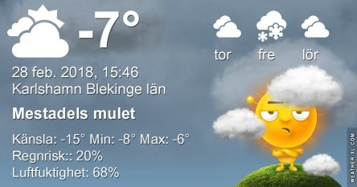
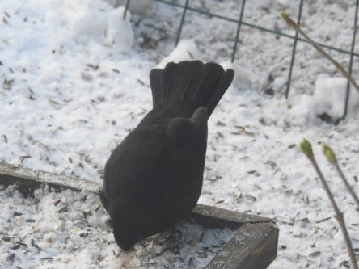
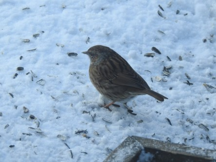
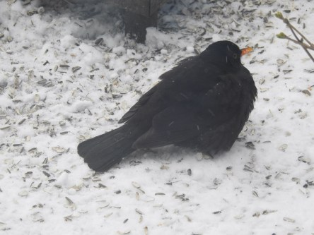

Idag går solen upp 06:56 och ned 17:31. Månen går upp 15:25 och ned 06:21 Månen är belyst 95 %. Dagens längd är 10 timmar och 35 minuter

 Snö - 10,7 C  Vindby 3,4 m/s NE  Luftfuktighet 81 %  hPa 1029  Snö ca 3 cm Kl.00:50

 Snö - ?  Vindby ?  Luftfuktighet ?  hPa ? Kl 07:00

 Växlande molnighet - 2,5 C  Vindby 3,8 m/s NW  Luftfuktighet 53 %  hPa 1029 Kl.13:25

 Växlande molnighet - 11,4 C  Vindby 2,2 m/s W  Luftfuktighet 71 %  hPa 1031  Snödjup ca. 5 cm Kl.20:00

 Riktigt snöoväder hela dagen med någon solglimt mellan snöbyarna.

Högst och lägst uppmätta temperatur igår (inofficiellt privat mätare): Max 0,7, Min – 11,1 C Högst uppmätta vind 5,1 m/s. Högst uppmätta vindby 11,6 m/s.

Högst och lägst uppmätta temperatur igår (officiellt enligt [YR.NO](http://www.vackertvader.se/v%C3%A4derstation/karlshamn?utm_source=email&utm_medium=email&utm_campaign=asarum)) Max – 5,7 C, Min – 10 C Högst uppmätta vind 4,4 m/s. Högst uppmätta vindby 13,8 m/s

 Koltrastar, bergfinkar och en järnsparv i jakt på mat i snöovädret.
