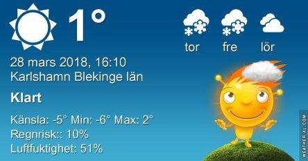
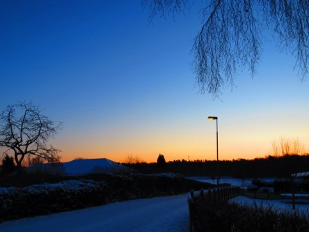
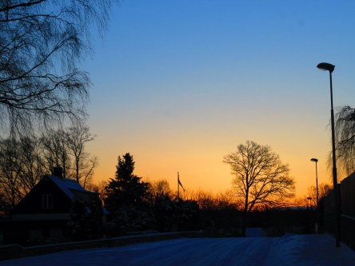

Idag går solen upp 06:42 och ned 19:30. Månen går upp 15:25 och ned 05:53 Månen är belyst 86 %. Dagens längd är 12 timmar och 48 minuter

 Växlande molnighet - 5,5 C  Vindby 0,6 m/s NW  Luftfuktighet 82 %  hPa 1012 Kl.02:00

 Växlande molnighet - 4 C  Vindby 1,2 m/s WNW  Luftfuktighet 64 %  hPa 1011 Kl.07:55

 Mest klart och blåsigt 3,6 C  Vindby 6,1 m/s NNE  Luftfuktighet 42 %  hPa 1010 Kl.13:55

 Klart - 3,8 C  Vindby 4,2 m/s ENE  Luftfuktighet 56 %  hPa 1008 Kl.20:05

 Soligt och blåsigt efter en iskall natt igen.

Högst och lägst uppmätta temperatur igår (inofficiellt privat mätare): Max 2,1 C  , Min – 4,2 C Högst uppmätta vind 3,4 m/s. Högst uppmätta vindby 7,8 m/s.

Högst och lägst uppmätta temperatur igår (officiellt enligt [YR.NO](http://www.vackertvader.se/v%C3%A4derstation/karlshamn?utm_source=email&utm_medium=email&utm_campaign=asarum)) Max - 1 C, Min – 4,2 C Högst uppmätta vind 4,4 m/s. Högst uppmätta vindby 9,3 m/s

 Dagens soluppgång. Det blev mycket sol idag men också blåsigt och kallt. Ingen vår direkt trots solen.
