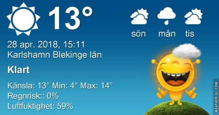
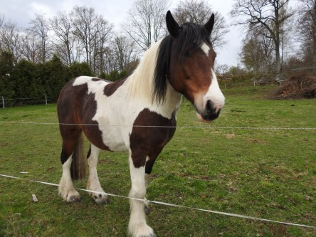
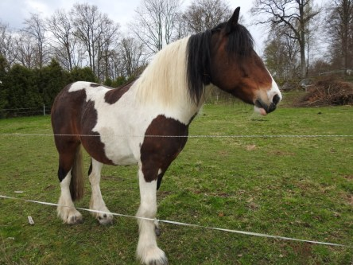
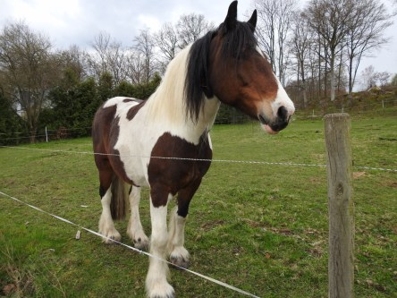
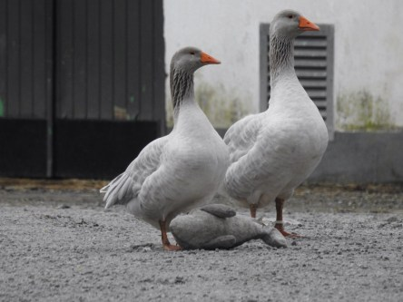
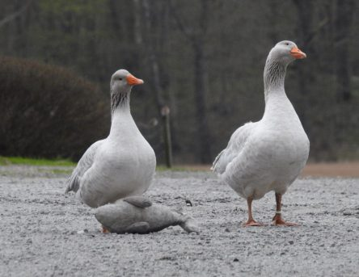

Idag går solen upp 05:23 och ned 20:33. Månen går upp 18:28 och ned 05:26 Månen är belyst 96 %. Dagens längd är 15 timmar och 10 minuter

 Molnigt 3,3 C  Vindstilla  Luftfuktighet 99 %  hPa 1008 Kl.01:25

 Halvklart 6,8 C  Vindstilla  Luftfuktighet 98 %  hPa 1006 Kl.07:30

 Halvklart 17,8 C  Vindby 2 m/s W  Luftfuktighet 48 %  hPa 1008 Kl.13:30

 Mest molnigt 8,4 C  Vindstilla  Luftfuktighet 73 %  hPa 1006 Kl.20:15

 Äntligen lite sol och värme igen.

Högst och lägst uppmätta temperatur igår (inofficiellt privat mätare): Max 13,2 C , Min 2,9 C Högst uppmätta vind 2,4 m/s. Högst uppmätta vindby 3,7 m/s.

Högst och lägst uppmätta temperatur igår (officiellt enligt [YR.NO](http://www.vackertvader.se/v%C3%A4derstation/karlshamn?utm_source=email&utm_medium=email&utm_campaign=asarum)) Max 11,7 C, Min 3,1 C Högst uppmätta vind 4 m/s. Högst uppmätta vindby 8,8 m/s

 Den här vackra hästen såg vi igår när vi var ute och red.

 Try är mest intresserad av mat, inte av vad Johannes vill.

 Vi stötte även på det här roliga gänget med gäss.
