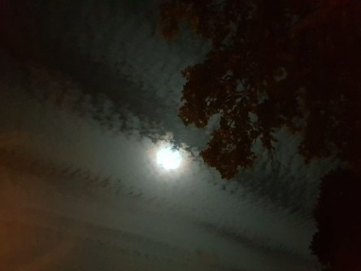
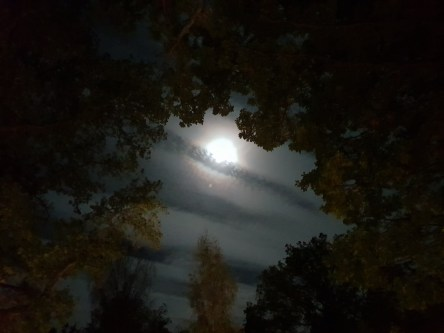

Idag går solen upp 06:57 och ned 18:44. Dagens längd är 11 timmar och 47 minuter. Det är gryning 06:20 och skymning 19:21 Det är dagsljus 13 timmar och 01 minuter. Månen går upp 20:31 och ned 10:27 Månen är belyst 91 %.

 Växlande molnighet 10,1 C  Vindby 2,7 m/s ESE   Luftfuktighet 78 %  hPa 1006 Kl.01:30

 Halvklart 7,3 C  Vindby 2,6 m/s NNW  Luftfuktighet 81 %  hPa 1008 Kl.07:20

 Små moln 18,1 C  Vindby 4 m/s W  Luftfuktighet 28 %  hPa 1014 Kl.14:05

 Klart 3,4 C  Vindstilla  Luftfuktighet 67 %  hPa 1017 Kl.20:00

 Ännu en solig dag med blå himmel och inget regn!

Högst och lägst uppmätta temperatur igår (inofficiellt privat mätare): Max 19,5 C , Min 9,5 C Högst uppmätta vind 4,8 m/s (?), Högst uppmätta vindby 8,2 m/s (?)

Högst och lägst uppmätta temperatur igår (officiellt enligt [YR.NO](http://www.vackertvader.se/v%C3%A4derstation/karlshamn?utm_source=email&utm_medium=email&utm_campaign=asarum)) Max 17,9 C, Min 11,7 C Högst uppmätta vind 4,6 m/s. Högst uppmätta vindby 13,2 m/s

 Det var en väldigt speciell himmel inatt med vackra moln och lysande måne.
