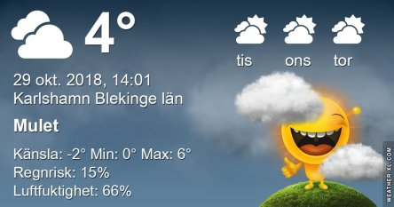

Idag går solen upp 07:01 och ned 16:26. Dagens längd är 9 timmar och 25 minuter. Det är gryning 06:22 och skymning 17:06 Det är dagsljus 10 timmar och 44 minuter. Månen går upp 20:05 och ned 12:14 Månen är belyst 87 %.

 Mest molnigt - 0,5 C  Vindby 2,7 m/s WSW  Luftfuktighet 81 %  hPa 1019 Kl.01:35

 Mest molnigt 1,4 C  Vindby 4,4 m/s E  Luftfuktighet 82 %  hPa 1018 Kl.06:20

 Molnigt 5,7 C  Vindby 5 m/s NW  Luftfuktighet 72 %  hPa 1014 Kl.13:40

 Molnigt och duggregn 3,2 C  Vindby 7,2 m/s NNE  Luftfuktighet 91 %  hPa 1010  Regn 0,5 mm Kl.19:45

 Nu blir det varmare igen! Jippi!

Högst och lägst uppmätta temperatur igår (inofficiellt privat mätare): Max 9,4 C , Min – 5 C Högst uppmätta vind 2,7 m/s, Högst uppmätta vindby 5,8 m/s

Högst och lägst uppmätta temperatur igår (officiellt enligt [YR.NO](http://www.vackertvader.se/v%C3%A4derstation/karlshamn?utm_source=email&utm_medium=email&utm_campaign=asarum)) Max 5,3 C, Min – 1,3 C Högst uppmätta vind 3,5 m/s. Högst uppmätta vindby 10,5 m/s

 Ha en bra måndagkväll!

 Mutor fungerar nästan alltid!
