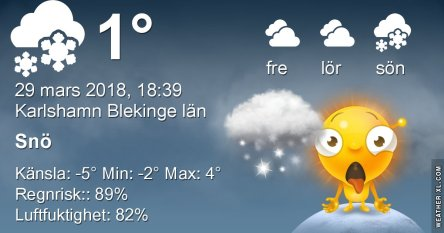

Idag går solen upp 06:40 och ned 19:32. Månen går upp 16:47 och ned 06:20 Månen är belyst 93 %. Dagens längd är 12 timmar och 52 minuter

 Mest klart - 4,6 C  Vindby 2,6 m/s ENE  Luftfuktighet 61 %  hPa 1004 Kl.02:10

 Molnigt - 2,4 C  Vindby 3,7 m/s SW  Luftfuktighet 66 %  hPa 1002 Kl.07:15

 Blåsigt 5 C  Vindby 9,2 m/s SW  Luftfuktighet 47 %  hPa 1001 Kl.13:45

 Snö - 1,7 C  Vindby 5,1 m/s SE  Luftfuktighet 92 %  hPa 1001 Kl.19:55

 Helt otroligt, snöstorm igen! Suck.

Högst och lägst uppmätta temperatur igår (inofficiellt privat mätare): Max 5,5 C  , Min – 7,8 C Högst uppmätta vind 5,1 m/s. Högst uppmätta vindby 11 m/s.

Högst och lägst uppmätta temperatur igår (officiellt enligt [YR.NO](http://www.vackertvader.se/v%C3%A4derstation/karlshamn?utm_source=email&utm_medium=email&utm_campaign=asarum)) Max 1,1 C, Min – 7,6 C Högst uppmätta vind 6,5 m/s. Högst uppmätta vindby 11,8 m/s

 Dagen började ganska bra men övergick sedan i snöstorm!
