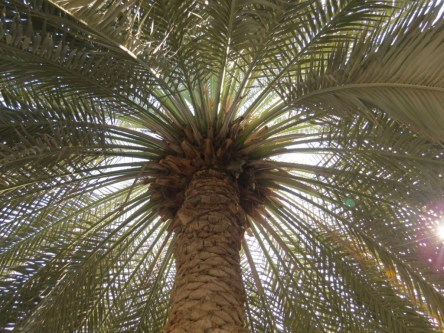

Idag går solen upp 05:21 och ned 20:35. Månen går upp 19:44 och ned 05:45 Månen är belyst 99 %. Dagens längd är 15 timmar och 14 minuter

 Växlande molnighet 4,6 C  Vindstilla  Luftfuktighet 94 %   hPa 1006 Kl.01:35

 Växlande molnighet 13,6 C  Vindstilla  Luftfuktighet 83 %  hPa 1005 Kl.07:35

 Växlande molnighet 19,8 C  Vindby 1,7 m/s N  Luftfuktighet 52 %  hPa 1007 Kl.13:35

 Molnigt 13,2 C  Vindstilla  Luftfuktighet 69 %  hPa 1008 Kl.19:55

 Det har varit en fin och varm dag men nu kommer det in ett oväder med regn och kanske åska.

Högst och lägst uppmätta temperatur igår (inofficiellt privat mätare): Max 24,1 C ( i solen ), Min 2,7 C Högst uppmätta vind 2,7 m/s. Högst uppmätta vindby 4,1 m/s.

Högst och lägst uppmätta temperatur igår (officiellt enligt [YR.NO](http://www.vackertvader.se/v%C3%A4derstation/karlshamn?utm_source=email&utm_medium=email&utm_campaign=asarum)) Max 13,5 C, Min 4,2 C Högst uppmätta vind 5 m/s. Högst uppmätta vindby 9,2 m/s

 Mitt arkiv fick hjälpa till idag igen. Här har jag drömt mig tillbaks till Dubai med palmer och Vitörad Bulbyl.
