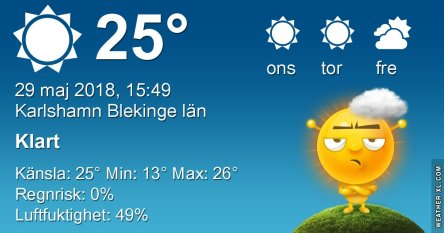
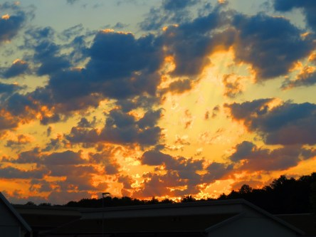
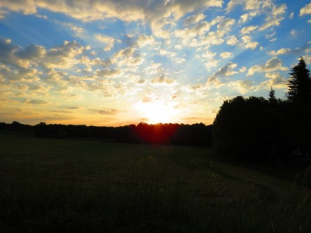
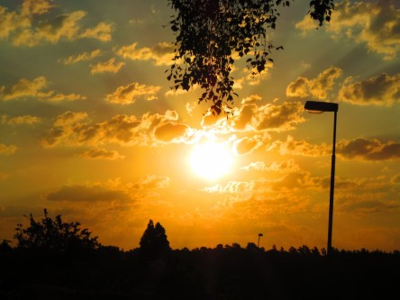

Idag går solen upp 04:25 och ned 21:31. Månen går upp 21:06 och ned 04:56 Månen är belyst 100 %. Dagens längd är 17 timmar och 6 minuter

 Halvklart 13,2 C  Vindby 1,6 m/s S  Luftfuktighet 83 %  hPa 1020 Kl.01:50

 Växlande molnighet 17,1 C  Vindby 1,6 m/s N  Luftfuktighet 70 %  hPa 1019 Kl.06:45

 Halvklart 30,7 C  Vindby 2,4 m/s WNW  Luftfuktighet 41 %  hPa 1018 Kl.14:15

 Mest klart 19,5 C  Vindby 0,6 m/s E  Luftfuktighet 72 %  hPa 1017 Kl.21:05

 Nu vill jag ha regn i massor!

Högst och lägst uppmätta temperatur igår (inofficiellt privat mätare): Max 35,3 C ( i solen ), Min 10,9 C Högst uppmätta vind 2,4 m/s. Högst uppmätta vindby 4,1 m/s

Högst och lägst uppmätta temperatur igår (officiellt enligt [YR.NO](http://www.vackertvader.se/v%C3%A4derstation/karlshamn?utm_source=email&utm_medium=email&utm_campaign=asarum)) Max 25,5 C, Min 11,8 C Högst uppmätta vind 5,1 m/s. Högst uppmätta vindby 8,9 m/s

 Soluppgången blir mer och mer dramatisk för varje dag. Den är vacker, men just ni inte så önskvärd på ett tag.
