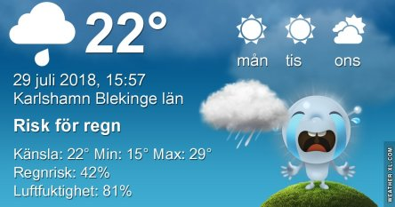
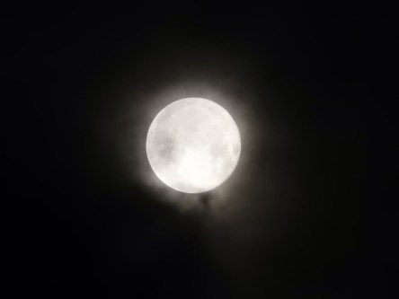
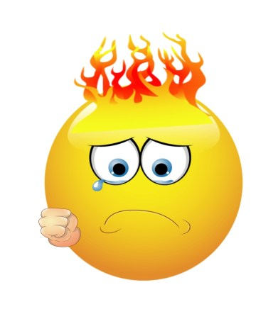

Idag går solen upp 04:58 och ned 21:15. Dagens längd är 16 timmar och 17 minuter. Det är gryning 04:07 och skymning 22:05 Det är dagsljus 17 timmar och 58 minuter. Månen går upp 22:09 och ned 06:19 Månen är belyst 99 %.

 Ökande molnighet 21 C  Vindby 0,6 m/s E  Luftfuktighet 91 %  hPa 1007 Kl.01:55

 Molnigt 21,6 C  Vindby 0,3 m/s SW  Luftfuktighet 93 %  hPa 1008 Kl.07:30

 Växlande molnighet 32,8 C  Vindby 1 m/s W  Luftfuktighet 46 %  hPa 1009 Kl.14:15

 Växlande molnighet 26,6 C  Vindby 1 m/s E  Luftfuktighet 53 %  hPa 1010 Kl.19:45

 Ännu syns inte en skymt av något regn!

Högst och lägst uppmätta temperatur igår (inofficiellt privat mätare): Max 32,9 C ( i solen ), Min 18,8 C Högst uppmätta vind 3,7 m/s. Högst uppmätta vindby 5,4 m/s

Högst och lägst uppmätta temperatur igår (officiellt enligt [YR.NO](http://www.vackertvader.se/v%C3%A4derstation/karlshamn?utm_source=email&utm_medium=email&utm_campaign=asarum)) Max 28,2 C, Min 19,8 C Högst uppmätta vind 5,5 m/s. Högst uppmätta vindby 11,1 m/s

 Jag satt i soffan och tog lite bilder på månen inatt. Det var så varmt att jag inte orkade gå ut. Men det blev rätt häftiga effekter när molnen svepte över månen.

 Och så här känner jag mig just nu. Värmen tar snart död på en.
