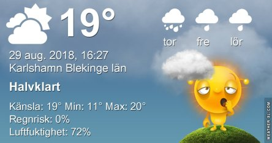
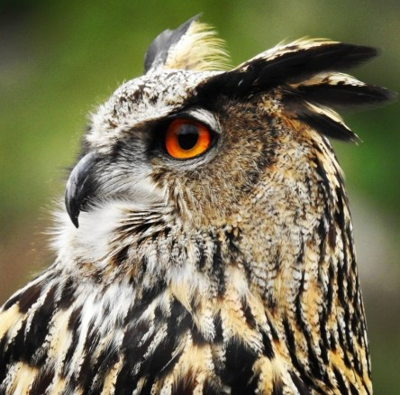

Idag går solen upp 05:58 och ned 20:04. Dagens längd är 14 timmar och 06 minuter. Det är gryning 05:18 och skymning 20:44 Det är dagsljus 15 timmar och 26 minuter. Månen går upp 21:28 och ned 08:52 Månen är belyst 94 %.

 Molnigt 13,2 C  Vindby 0,6 m/s SW  Luftfuktighet 95 %  hPa 1015 Kl.02:20

 Molnigt 13,4 C  Vindstilla  Luftfuktighet 97 %  hPa 1015 Kl.06:50

 Mest molnigt 25,2 C  Vindby 2,4 m/s NE  Luftfuktighet 68 %  hPa 1015 Kl.13:15

 Mest molnigt 16,1 C  Vindby 0,8 m/s SW  Luftfuktighet 87 % hPa 1013 Kl.19:50

 Idag har det varit betydligt varmare än förutspått.

Högst och lägst uppmätta temperatur igår (inofficiellt privat mätare): Max 21,9 C , Min 11,3 C Högst uppmätta vind 3,1 m/s. Högst uppmätta vindby 5,1 m/s

Högst och lägst uppmätta temperatur igår (officiellt enligt [YR.NO](http://www.vackertvader.se/v%C3%A4derstation/karlshamn?utm_source=email&utm_medium=email&utm_campaign=asarum)) Max 18,8 C, Min 12,4 C Högst uppmätta vind 2,4 m/s. Högst uppmätta vindby 8,4 m/s

 Även idag fick arkivet rycka in. Den här gången blir det minnen från Palmitos Park på Gran Canaria. Den här ståtliga Vithövdade örnen är en helt otroligt vacker fågel. Min dröm är att någon gång få se den i vilt tillstånd. Den finns bara i USA, Kanada, Alaska och i Mexico.

 Ännu en ståtlig och vacker fågel är Berguven.
