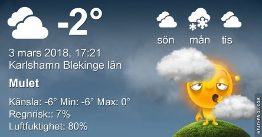
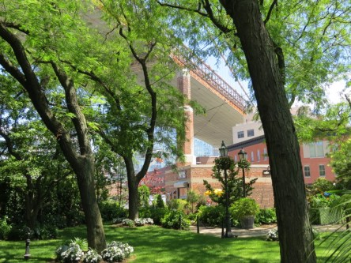

Idag går solen upp 06:48 och ned 17:38. Månen går upp 19:35 och ned 07:40 Månen är belyst 99 %. Dagens längd är 10 timmar och 50 minuter

 Molnigt - 5,2 C  Vindby 0,7 m/s SW  Luftfuktighet 80 %  hPa 1006 Kl.01:25

 Molnigt - 3,2 C  Vindby 0,7 m/s SW  Luftfuktighet 85 %  hPa 1005 Kl.07:15

 Molnigt 3,1 C  Vindby 1,2 m/s WSW  Luftfuktighet 64 %  hPa 1005 Kl.14:15

 Molnigt - 4,2 C  Vindby 0,3 m/s SE  Luftfuktighet 78 %  hPa 1006 Kl.20:10

 Tröttsamt grått väder men åtminstone lite varmare på gång.

Högst och lägst uppmätta temperatur igår (inofficiellt privat mätare): Max 0,4 C, Min – 6,6 C Högst uppmätta vind 3,1 m/s. Högst uppmätta vindby 7 m/s.

Högst och lägst uppmätta temperatur igår (officiellt enligt [YR.NO](http://www.vackertvader.se/v%C3%A4derstation/karlshamn?utm_source=email&utm_medium=email&utm_campaign=asarum)) Max – 2 C, Min – 5,2 C Högst uppmätta vind 3,9 m/s. Högst uppmätta vindby 7,7 m/s

 Eftersom våren låter vänta på sig så får man drömma sig tillbaka till varmare och trevligare platser. Här ligger några sköldpaddor och njuter av solen och värmen i Central Park i NY.

 Kanadagäss simmar lugnt i samma park.

 Ett härligt strilande litet vattenfall i Brooklyn Park.

 Utsikt upp mot Brooklyn Bridge.
