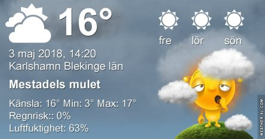
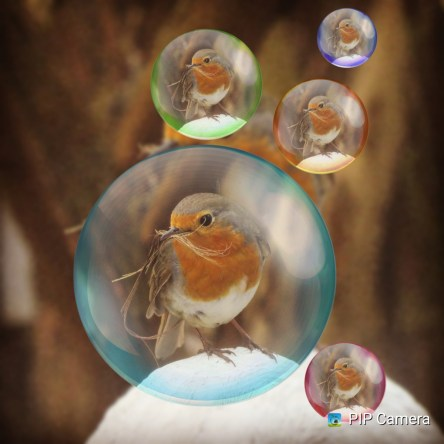

Idag går solen upp 05:12 och ned 20:43. Månen går upp 00:18 och ned 07:26 Månen är belyst 91 %. Dagens längd är 15 timmar och 31 minuter

 Mest molnigt 4,4 C  Vindstilla  Luftfuktighet 85 %  hPa 1010 Kl.01:30

 Molnigt 6,8 C  Vindby 3,8 m/s E  Luftfuktighet 92 %  hPa 1006 Kl.07:40

 Tunna slöjmoln 21,8 C  Vindby 2 m/s W  Luftfuktighet 63 %  hPa 1006 Kl.13:45

 Växlande molnighet 9,2 C  Vindby 1,6 m/s W  Luftfuktighet 54 %   hPa 1012 Kl.20:30

 Ganska soligt och fint idag. Men blåsigt igen.

Högst och lägst uppmätta temperatur igår (inofficiellt privat mätare): Max 17,7 C , Min 3,7 C Högst uppmätta vind 3,1 m/s. Högst uppmätta vindby 5,8 m/s.

Högst och lägst uppmätta temperatur igår (officiellt enligt [YR.NO](http://www.vackertvader.se/v%C3%A4derstation/karlshamn?utm_source=email&utm_medium=email&utm_campaign=asarum)) Max 12,5 C, Min 4,2 C Högst uppmätta vind 3,8 m/s. Högst uppmätta vindby 7,9 m/s

 Ny app med massor av roliga funktioner för att göra roliga bilder.
