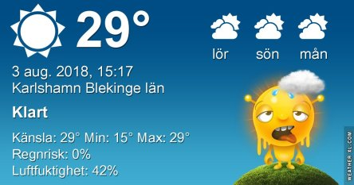
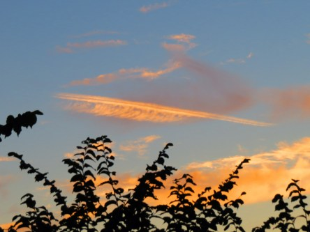
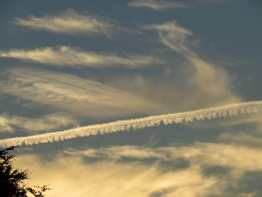

Idag går solen upp 05:07 och ned 21:05. Dagens längd är 15 timmar och 58 minuter. Det är gryning 04:19 och skymning 21:53 Det är dagsljus 17 timmar och 34 minuter. Månen går upp 23:40 och ned 12:16 Månen är belyst 67 %.

 Mest klart 13,7 C  Vindstilla  Luftfuktighet 79 %  hPa 1018 Kl.01:50

 Tunna fjädermoln 13,1 C  Vindstilla  Luftfuktighet 91 %  hPa 1018 Kl.06:30

 Mest klart 33,2 C  Vindby 4 m/s NNW  Luftfuktighet 37 %  hPa 1016 Kl.14:40

 Halvklart25,3 C  Vindby 2,8 m/s NNW  Luftfuktighet 34 %  hPa 1013 Kl.20:10

 Efter en underbart sval natt med 11 grader så var det dags igen för solen att göra sitt för att förstöra den känslan!

Högst och lägst uppmätta temperatur igår (inofficiellt privat mätare): Max 34,7 C ( i solen ), Min 15,9 C Högst uppmätta vind 3,1 m/s. Högst uppmätta vindby 4,4 m/s

Högst och lägst uppmätta temperatur igår (officiellt enligt [YR.NO](http://www.vackertvader.se/v%C3%A4derstation/karlshamn?utm_source=email&utm_medium=email&utm_campaign=asarum)) Max 30,6 C, Min 14,8 C Högst uppmätta vind 3 m/s. Högst uppmätta vindby 8,1 m/s

 En härlig morgonhimmel och underbart svalt med 11 grader idag.

 En fjäder i hatten!

 En svan i skyn? Eller ett gammalt vikingaskepp? Vad ser ni?

 Men vad är detta? Inget naturligt moln i alla fall.

 Och det försvann aldrig och blev inte svagare heller på de 45 minuterna som jag körde där.  Mer molnfenomen. Det var gott om dem idag.
