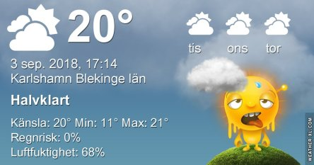
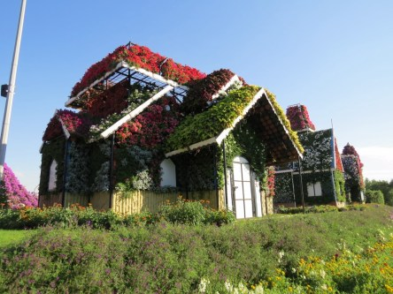
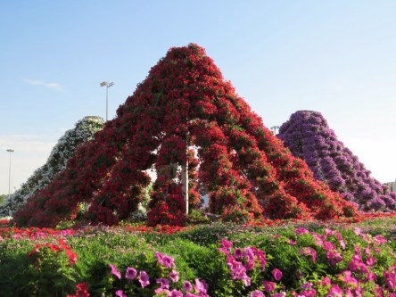

Idag går solen upp 06:08 och ned 19:51. Dagens längd är 13 timmar och 43 minuter. Det är gryning 05:29 och skymning 20:30 Det är dagsljus 15 timmar och 01 minuter. Månen går upp 22:35 och ned 13:09 Månen är belyst 50 %.

 Mest klart 9,4 C  Vindstilla  Luftfuktighet 97 %  hPa 1023 Kl.02:25

 Dimma och mulet 10,8 C  Vindby 0,3 m/s NW  Luftfuktighet 97 %  hPa 1022 Kl.06:15

 Små moln 27,4 C  Vindby 2,6 m/s ESE  Luftfuktighet 46 %  hPa 1020 Kl.13:45

 Slöjmoln 14,7 C  Vindstilla  Luftfuktighet 80 %  hPa 1018 Kl.20:20

 Idag har det varit väldigt varmt igen. Och inget regn, suck.

Högst och lägst uppmätta temperatur igår (inofficiellt privat mätare): Max 25,9 C , Min 8,8 C Högst uppmätta vind 1,7 m/s. Högst uppmätta vindby 2,7 m/s

Högst och lägst uppmätta temperatur igår (officiellt enligt [YR.NO](http://www.vackertvader.se/v%C3%A4derstation/karlshamn?utm_source=email&utm_medium=email&utm_campaign=asarum)) Max 21,4 C, Min 8,2 C Högst uppmätta vind 3,7 m/s. Högst uppmätta vindby 6,1 m/s

 Idag blir det arkivbilder från Dubai, Miracle Garden där allt är gjort av blommor och frukt.
