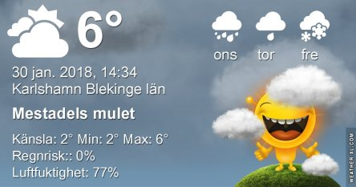

Idag går solen upp 08:01 och ned 16:27. Månen går upp 15:13 och ned 07:03 Månen är belyst 97 %. Dagens längd är 8 timmar och 26 minuter

 Molnigt 3 C  Vindby 4,4 m/s WNW  Luftfuktighet 91 %  hPa 1000 Kl.01:45

 Regnskurar 2,5 C  Vindby 3,4 m/s SW  Luftfuktighet 89 %  hPa 1004  Regn 0,5 mm Kl.06:25

 Växlande molnighet 6,8 C  Vindby 5,2 m/s SSW  Luftfuktighet 63 %  hPa 1010 Kl.14:35

 Halvklart 2,8 C  Vindby 1,4 m/s N  Luftfuktighet 85 %  hPa 1011 Kl.21:15

 Fick äntligen se lite sol idag.

Högst och lägst uppmätta temperatur igår (inofficiellt privat mätare): Max 8,7 C , Min 3,6 C Högst uppmätta vind 7,5 m/s. Högst uppmätta vindby 11,2 m/s.

Högst och lägst uppmätta temperatur igår (officiellt enligt [YR.NO](http://www.vackertvader.se/v%C3%A4derstation/karlshamn?utm_source=email&utm_medium=email&utm_campaign=asarum)) Max 7,6 C, Min 3,4 C Högst uppmätta vind 6,1 m/s. Högst uppmätta vindby 15,7 m/s

 Det är inte särskilt mycket att hurra för men det är dock en soluppgång för första gången på ett bra tag.
