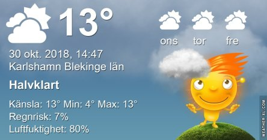

Idag går solen upp 07:04 och ned 16:24. Dagens längd är 9 timmar och 20 minuter. Det är gryning 06:24 och skymning 17:04 Det är dagsljus 10 timmar och 40 minuter. Månen går upp 21:12 och ned 13:11 Månen är belyst 66 %.

 Molnigt 5 C  Vindby 5,4 m/s NE  Luftfuktighet 89 %  hPa 1002 Kl.02:10

 Regnskurar 7,4 C  Vindby 5,6 m/s ENE  Luftfuktighet 94 %  hPa 997  Regn 1,5 mm KL.07:10

 Molnigt 13,6 C  Vindby 5,1 m/s N  Luftfuktighet 80 %  hPa 992  Regn 2 mm Kl.14:40

 Växlande molnighet 8,1 C  Vindby 1,2 m/s W  Luftfuktighet 83 %  hPa 994 Kl.21:10

 Milt och blåsigt och lite mer regn idag.

Högst och lägst uppmätta temperatur igår (inofficiellt privat mätare): Max 5,7 C , Min – 0,5 C Högst uppmätta vind 4,1 m/s, Högst uppmätta vindby 8,8 m/s

Högst och lägst uppmätta temperatur igår (officiellt enligt [YR.NO](http://www.vackertvader.se/v%C3%A4derstation/karlshamn?utm_source=email&utm_medium=email&utm_campaign=asarum)) Max 5,2 C, Min 1 C Högst uppmätta vind 4 m/s. Högst uppmätta vindby 12,6 m/s

 Håller helt klart med om det sista 😱

 Klok tanke!

 Bron vid infarten till Karlskrona i morgonljus.
