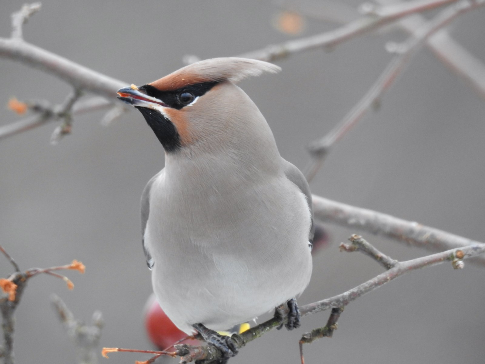
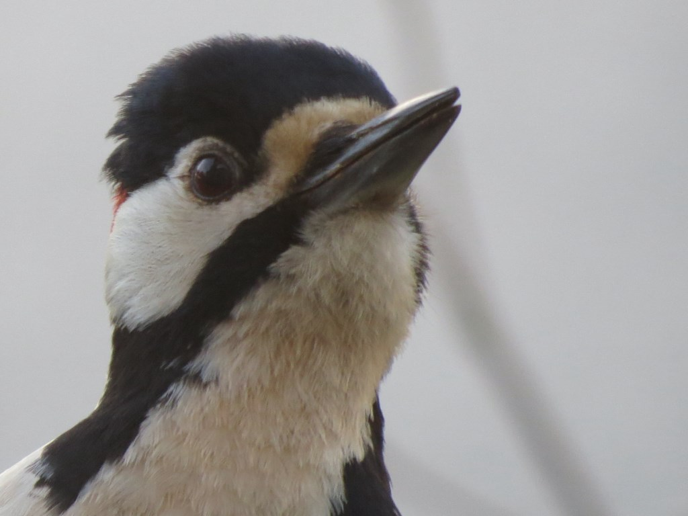
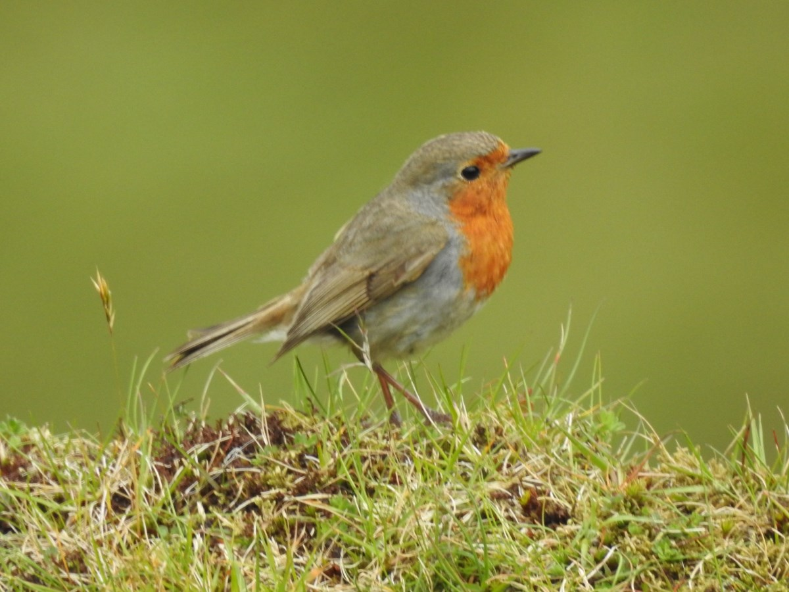
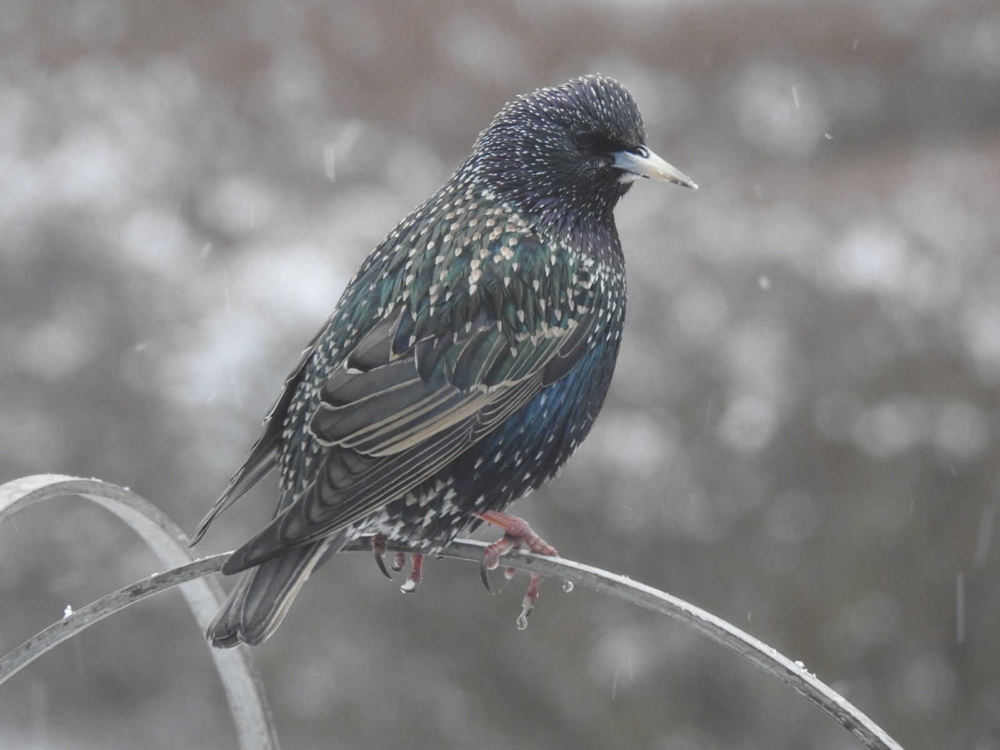
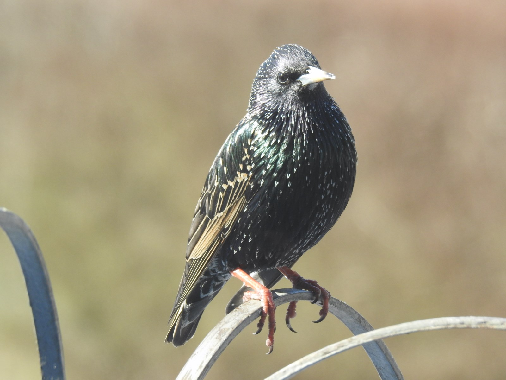

Idag går solen upp 08:07 och ned 15:31  
Dagens längd är 7 timmar och 24 minuter.  
Det är gryning 07:21 och skymning 16:17  
Det är dagsljus 8 timmar och 56 minuter.  
Månen går upp 22:48 och ned 13:30  
Månen är belyst 49 %.

Regn 1,4 C Vindby 3,4 m/s E Luftfuktighet 78 % hPa 1011 Regn 1 mm  
Kl.02:15

Regn 1,3 C Vindby 3,4 m/s SSW Luftfuktighet 79 % hPa 1010 Regn 2,7 mm  
Kl.06:35

  
Regn 3,1 C Vindby 3,8 m/s ENE Luftfuktighet 84 % hPa 1010 Regn 6 mm  
Kl.14:15

  
Regn 3 C Vindby 3,7 m/s ENE Luftfuktighet 91 % hPa 1010 Regn 9,5 mm  
Kl.20:20

  
Grått, regn och någon plusgrad.

Högst och lägst uppmätta temperatur igår (inofficiellt privat mätare)  
Max 4,1 C , Min 0,6 C  
Högst uppmätta vind 5,4 m/s, Högst uppmätta vindby 9,9 m/s

Högst och lägst uppmätta temperatur igår (officiellt enligt [YR.NO](http://www.vackertvader.se/v%C3%A4derstation/karlshamn?utm_source=email&utm_medium=email&utm_campaign=asarum))  
Max 3,5 C, Min 2 C  
Högst uppmätta vind 4,5 m/s. Högst uppmätta vindby 12,5 m/s

- 
    
- 
    
- 
    
- 
    
- 
    
- 
    
- 
    
- 
    
- 
    
- 
    
- 
    

Valde ut lite äldre bilder på fåglar till ett galleri idag.
