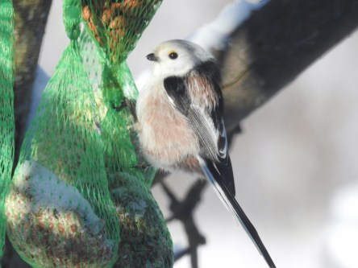

Idag går solen upp 06:37 och ned 19:34. Månen går upp 18:09 och ned 06:42 Månen är belyst 97 %. Dagens längd är 12 timmar och 57 minuter

 Molnigt - 1,1 C  Vindby 2,6 m/s N  Luftfuktighet 86 %  hPa 1001 Kl.02:25

 Molnigt 0 C  Vindby 1,4 m/s SSE  Luftfuktighet 83 %  hPa 1002 Kl.07:45

 Molnigt 1,9 C  Vindby 2 m/s E  Luftfuktighet 61 %  hPa 1006 Kl.13:15

 Molnigt - 0,3 C  Vindstilla  Luftfuktighet 67 %  hPa 1006 Kl.19:45

 Grått och tröttsamt väder även idag.

Högst och lägst uppmätta temperatur igår (inofficiellt privat mätare): Max 5,1 C  , Min – 4,6 C Högst uppmätta vind 5,8 m/s. Högst uppmätta vindby 9,2 m/s.

Högst och lägst uppmätta temperatur igår (officiellt enligt [YR.NO](http://www.vackertvader.se/v%C3%A4derstation/karlshamn?utm_source=email&utm_medium=email&utm_campaign=asarum)) Max 3,7 C, Min – 3,1 C Högst uppmätta vind 4,9 m/s. Högst uppmätta vindby 14,3 m/s

 Några av dagens gäster vid matbordet.

 Det här konstverket utanför en skola i Asarum är som ett ljus i mörkret som piggar upp just nu.

 Här har jag gjort en extrem bild av en bild jag tog igår på morgonen. Med extra mycket färg och glow blir det en ganska kul effekt som mer liknar en målning än ett foto. Snyggt eller inte är en smaksak men just nu längtar man efter färger.
