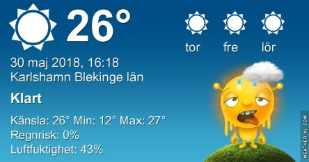
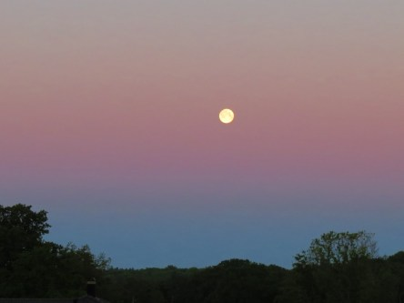
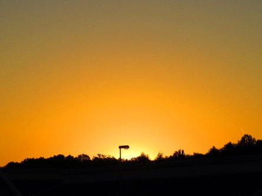
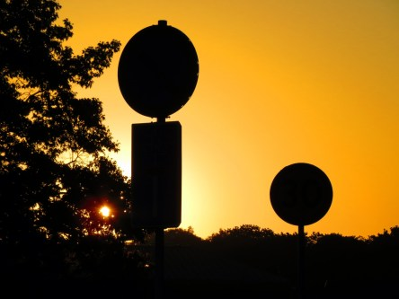

Idag går solen upp 04:23 och ned 21:33. Månen går upp 22:09 och ned 05:25 Månen är belyst 100 %. Dagens längd är 17 timmar och 10 minuter

 Klart 13,9 C  Vindby 1 m/s W  Luftfuktighet 90 %  hPa 1016 Kl.01:45

 Klart 19,6 C  Vindby 2,4 m/s SW  Luftfuktighet 62 %  hPa 1015 Kl.06:55

 Klart 34,7 C  Vindby 4,2 m/s SSE  Luftfuktighet 34 %  hPa 1017 Kl.14:50

 Klart 22,7 C  Vindby 2,8 m/s N  Luftfuktighet 51 %  hPa 1017 Kl.19:50

 Ord känns överflödiga nu.

Högst och lägst uppmätta temperatur igår (inofficiellt privat mätare): Max 33,7 C ( i solen ), Min 12,8 C Högst uppmätta vind 2,7 m/s. Högst uppmätta vindby 5,4 m/s

Högst och lägst uppmätta temperatur igår (officiellt enligt [YR.NO](http://www.vackertvader.se/v%C3%A4derstation/karlshamn?utm_source=email&utm_medium=email&utm_campaign=asarum)) Max 25,7 C, Min 11,8 C Högst uppmätta vind 4,6 m/s. Högst uppmätta vindby 9 m/s

 Fullmånen lyser från en klar himmel.

 Bäddat för ännu en stekhet dag.
