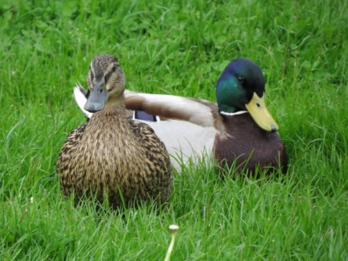
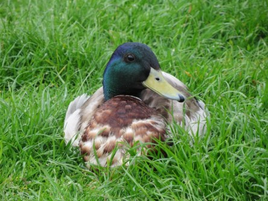

Idag går solen upp 06:00 och ned 20:01. Dagens längd är 14 timmar och 01 minuter. Det är gryning 05:20 och skymning 20:41 Det är dagsljus 15 timmar och 21 minuter. Månen går upp 21:45 och ned 10:06 Månen är belyst 88 %.

 Växlande molnighet 11,7 C  Vindby 0,3 m/s NW  Luftfuktighet 99 %  hPa 1011 Kl.02:25

 Ökande molnighet 14,2 C  Vindby 0,3 m/s W  Luftfuktighet 99 %  hPa 1010 Kl.07:05

 Molnigt 22,9 C  Vindby 2 m/s E  Luftfuktighet 68 %  hPa 1010 Kl.13:25

 Molnigt och regn 14,6 C  Vindby 0,3 m/s NW  Luftfuktighet 95 %  hPa 1010  Regn 1,8 mm Kl.19:55

 Ett härligt sommarregn ikväll. Ljummet och strilande.

Högst och lägst uppmätta temperatur igår (inofficiellt privat mätare): Max 25,8 C , Min 11,9 C Högst uppmätta vind 1,7 m/s. Högst uppmätta vindby 2,7 m/s

Högst och lägst uppmätta temperatur igår (officiellt enligt [YR.NO](http://www.vackertvader.se/v%C3%A4derstation/karlshamn?utm_source=email&utm_medium=email&utm_campaign=asarum)) Max 20,4 C, Min 11,4 C Högst uppmätta vind 3,5 m/s. Högst uppmätta vindby 6,2 m/s

 Ur arkivet igen. Gräsänder som tar det lugnt och njuter av livet.
