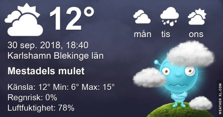
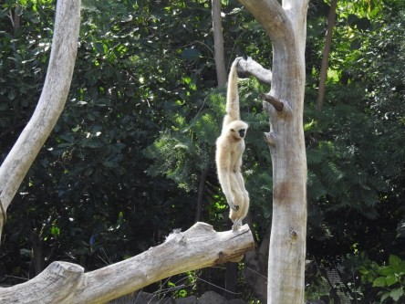
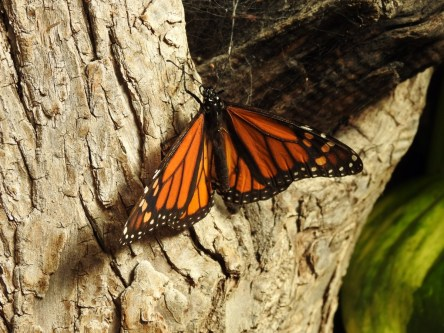

Idag går solen upp 07:01 och ned 18:39. Dagens längd är 11 timmar och 38 minuter. Det är gryning 06:24 och skymning 19:16 Det är dagsljus 12 timmar och 52 minuter. Månen går upp 21:32 och ned 13:01 Månen är belyst 75 %.

 Växlande molnighet 8,6 C  Vindby 2 m/s NE  Luftfuktighet 78 %  hPa 1013 Kl.01:25

 Mest molnigt 11,7 C  Vindby 3,7 m/s NE  Luftfuktighet 79 %  hPa 1010 Kl.07:30

 Molnigt 15,6 C  Vindby 5,1 m/s E  Luftfuktighet 65 %  hPa 1008 Kl.13:25

 Molnigt 9,7 C  Vindby 1,4 m/s WNW  Luftfuktighet 84 %  hPa 1007 Kl.19:55

 Först klagar man på värmen och nu klagar man på kylan. Jag fryser nu!

Högst och lägst uppmätta temperatur igår (inofficiellt privat mätare): Max 17,2 C , Min – 3,4 C Högst uppmätta vind 3,4 m/s, Högst uppmätta vindby 5,1 m/s

Högst och lägst uppmätta temperatur igår (officiellt enligt [YR.NO](http://www.vackertvader.se/v%C3%A4derstation/karlshamn?utm_source=email&utm_medium=email&utm_campaign=asarum)) Max 13,9 C, Min – 3,4 C Högst uppmätta vind 2,7 m/s. Högst uppmätta vindby 7,5 m/s

 Några minnesbilder från Palmitos park i Maspalomas. Först en vit stork. Sen natthäger, krontrana, gibbonapa, sköldpaddor och några olika fjärilar som jag inte har en aning vad de heter.
