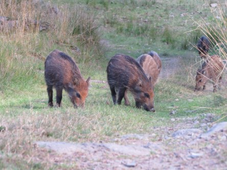

Idag går solen upp 06:34 och ned 19:36. Månen går upp 19:29 och ned 07:02 Månen är belyst 100 %. Dagens längd är 13 timmar och 2 minuter

 Växlande molnighet - 6,6 C  Vindstilla  Luftfuktighet 84 %  hPa 1006 Kl.02:05

 Molnigt - 2,5 C  Vindby 3,4 m/s SE  Luftfuktighet 80 %  hPa 1004 Kl.06:55

 Molnigt 5,1 C  Vindby 3 m/s S  Luftfuktighet 66 %  hPa 1004 Kl.13:40

 Molnigt 0,1 C  Vindby 2,6 m/s NW  Luftfuktighet 73 %  hPa 1001 Kl.20:50

 Sista mars och ingen vår ännu.

Högst och lägst uppmätta temperatur igår (inofficiellt privat mätare): Max 3,2 C  , Min – 3,7 C Högst uppmätta vind 2,4 m/s. Högst uppmätta vindby 3,7 m/s.

Högst och lägst uppmätta temperatur igår (officiellt enligt [YR.NO](http://www.vackertvader.se/v%C3%A4derstation/karlshamn?utm_source=email&utm_medium=email&utm_campaign=asarum)) Max 2,1 C, Min – 4 C Högst uppmätta vind 3,4 m/s. Högst uppmätta vindby 7,8 m/s

 Den här söta vildsvinsfamiljen på Eriksbergs vilt från förra våren får avsluta mars månads inlägg.
