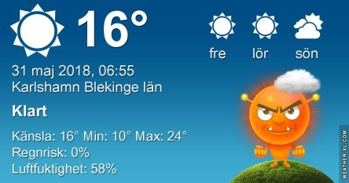
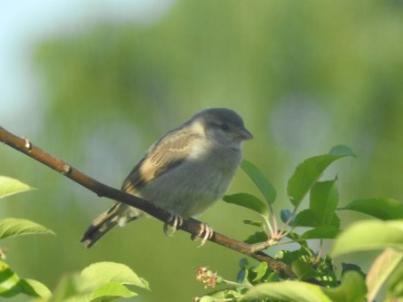
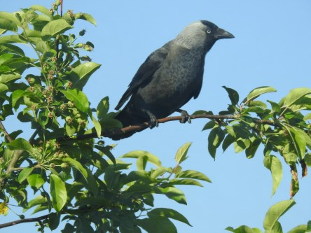
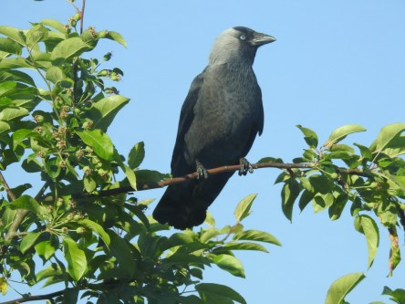

Idag går solen upp 04:22 och ned 21:34. Månen går upp 23:06 och ned 06:01 Månen är belyst 98 %. Dagens längd är 17 timmar och 12 minuter

 Klart 13,4 C  Vindby 1,6 m/s SE  Luftfuktighet 67 %  hPa 1017 Kl.02:00

 Klart 18,6 C  Vindby 3 m/s N  Luftfuktighet 51 %  hPa 1017 Kl.07:10

 Klart 33,7 C  Vindby 2,8 m/s ESE  Luftfuktighet 30 %  hPa 1017 Kl.14:10

 Klart 20,7 C  Vindby 4,4 m/s SSW Luftfuktighet 50 %  hPa 1017 Kl.19:50

 Nu brinner det lite varstans. Nu behövs det regn i mängder.

Högst och lägst uppmätta temperatur igår (inofficiellt privat mätare): Max 34,7 C ( i solen ), Min 13,6 C Högst uppmätta vind 2,7 m/s. Högst uppmätta vindby 5,2 m/s

Högst och lägst uppmätta temperatur igår (officiellt enligt [YR.NO](http://www.vackertvader.se/v%C3%A4derstation/karlshamn?utm_source=email&utm_medium=email&utm_campaign=asarum)) Max 27.8 C, Min 12,9 C Högst uppmätta vind 5,4 m/s. Högst uppmätta vindby 9,5 m/s

 Det finns de som verkar trivas trots värmen.
