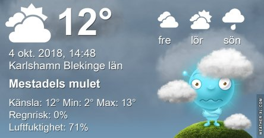
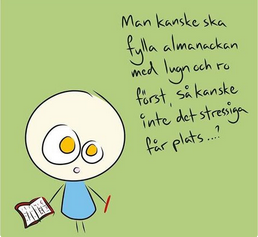

Idag går solen upp 07:09 och ned 18:28. Dagens längd är 11 timmar och 19 minuter. Det är gryning 06:32 och skymning 19:05 Det är dagsljus 12 timmar och 33 minuter. Månen går upp 00:26 och ned 16:51 Månen är belyst 32 %.

 Mest klart - 2,4 C  Vindstilla  Luftfuktighet 97 %  hPa 1013 Kl.01:30

 Klart - 2,7 C  Vindstilla  Luftfuktighet 99 %  hPa 1015 Kl.04:40

 Mest molnigt 16 C  Vindby 1,7 m/s E  Luftfuktighet 57 %  hPa 1016 Kl.13:45

 Molnigt 9,8 C  Vindby 1 m/s E  Luftfuktighet 89 %  hPa 1015 Kl.19:50

 Det var en fin dag med skön sensommarvärme efter en kall natt. Men på kvällen blev det riktigt kyligt igen.

Högst och lägst uppmätta temperatur igår (inofficiellt privat mätare): Max 15,1 C , Min – 1,7 C Högst uppmätta vind 3,4 m/s, Högst uppmätta vindby 5,1 m/s

Högst och lägst uppmätta temperatur igår (officiellt enligt [YR.NO](http://www.vackertvader.se/v%C3%A4derstation/karlshamn?utm_source=email&utm_medium=email&utm_campaign=asarum)) Max 11,5 C, Min – 0,5 C Högst uppmätta vind 5,4 m/s. Högst uppmätta vindby 12,6 m/s

 Det går inte att få nog av dessa kloka ord, så här kommer några till av mina favoriter.
