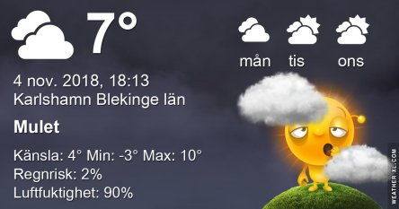
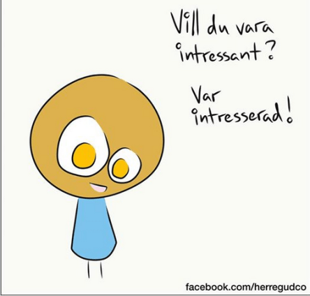
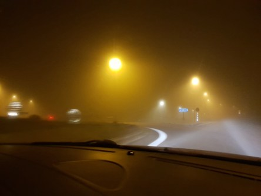
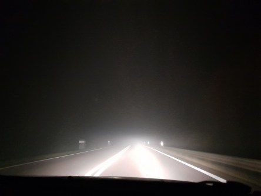
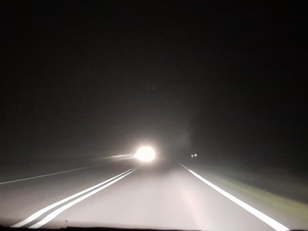
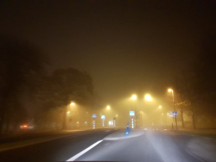
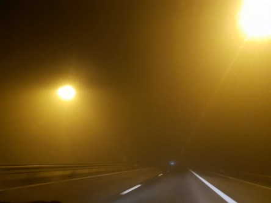
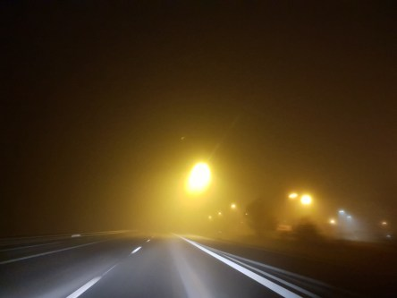

Idag går solen upp 07:14 och ned 16:13 Dagens längd är 8 timmar och 59 minuter. Det är gryning 06:34 och skymning 16:54 Det är dagsljus 10 timmar och 20 minuter. Månen går upp 02:33 och ned 15:37 Månen är belyst 15 %.

 Dimma 0,4 C  Vindstilla  Luftfuktighet 88 %  hPa 1024 Kl.02:30

 Mest molnigt 5 C  Vindby 0,3 m/s NW  Luftfuktighet 94 %  hPa 1023 Kl.07:00

 Molnigt 10,8 C  Vindby 2 m/s E  Luftfuktighet 78 %  hPa 1021 Kl.13:35

 Molnigt 7,5 C  Vindby 2,2 m/s SSE  Luftfuktighet 78 %  hPa 1018 Kl.20:00

 Mest molnigt och milt hela dagen

Högst och lägst uppmätta temperatur igår (inofficiellt privat mätare): Max 14,8 C , Min - 1,5 C Högst uppmätta vind 3,1 m/s, Högst uppmätta vindby 4,4 m/s

Högst och lägst uppmätta temperatur igår (officiellt enligt [YR.NO](http://www.vackertvader.se/v%C3%A4derstation/karlshamn?utm_source=email&utm_medium=email&utm_campaign=asarum)) Max 11 C, Min - 3,4 C Högst uppmätta vind 3,1 m/s. Högst uppmätta vindby 9,1 m/s

 Några tänkvärda och kloka ord.

 Så här dimmigt var det hela vägen hem från Helsingborg igårkväll. Det tog mycket längre tid än vanligt att köra hem för bitvis såg vi inte handen framför oss nästan.
