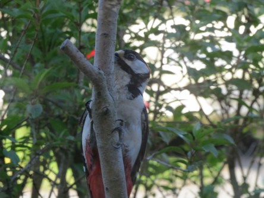
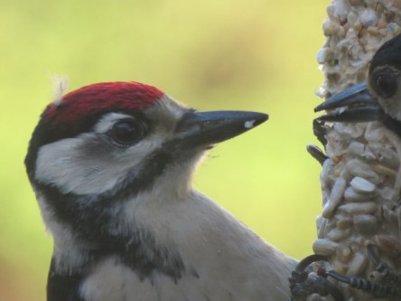
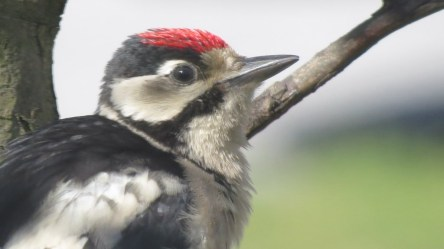
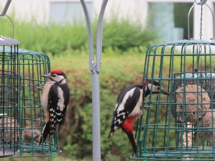
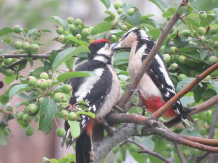
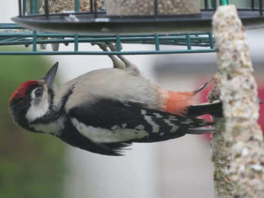

Idag går solen upp 06:24 och ned 19:44. Månen går upp 00:26 och ned 08:27 Månen är belyst 86 %. Dagens längd är 13 timmar och 20 minuter

 Molnigt 1,2 C  Vindby 1,4 m/s SW  Luftfuktighet 97 %  hPa 999 Kl.02:20

 Dimma och regn 3,6 C  Vindby 2 m/s SSW  Luftfuktighet 99 %  hPa 997  Regn 1 mm Kl.06:45

 Soligt med ett tunt molntäcke 19,6 C  ( i solen ) Vindby 2 m/s W  Luftfuktighet 55 %  hPa 996 Kl.13:20

 Växlande molnighet 4,8 C  Vindstilla  Luftfuktighet 76 %  hPa 999 Kl.20:10

 Rena sommaren idag. Äntligen. Får se hur länge det varar den här gången.

Högst och lägst uppmätta temperatur igår (inofficiellt privat mätare): Max 5,5 C , Min – 6,9 C Högst uppmätta vind 2 m/s. Högst uppmätta vindby 3,7 m/s.

Högst och lägst uppmätta temperatur igår (officiellt enligt [YR.NO](http://www.vackertvader.se/v%C3%A4derstation/karlshamn?utm_source=email&utm_medium=email&utm_campaign=asarum)) Max 1,6 C, Min – 4,8 C Högst uppmätta vind 2,8 m/s. Högst uppmätta vindby 6,7 m/s

Idag har det varit sommarväder och jag har haft fullt upp i trädgården. Så eftersom jag inte hunnit ta några bilder så plockar jag ur arkivet igen. Det här är för några år sedan när pappa Hacke kom på besök för att mata sina småttingar varje dag. Han hade tre småhackar att mätta. Och även jag lagt upp dem tidigare så tål de att ses igen.
