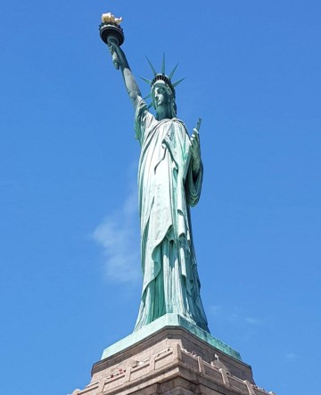
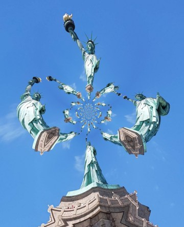

Idag går solen upp 05:10 och ned 20:45. Månen går upp 00:18 och ned 08:06 Månen är belyst 85 %. Dagens längd är 15 timmar och 35 minuter

 Halvklart - 0,2 C  Vindstilla  Luftfuktighet 92 %  hPa 1016 Kl.01:40

 Mest klart 3,6 C  Vindby 0,7 m/s NE  Luftfuktighet 84 %  hPa 1017 Kl.07:30

 Tunna slöjmoln 23,4 C  Vindby 3,6 m/s WNW  Luftfuktighet 35 %   hPa 1018 Kl.13:20

 Halvklart 13,4 C  Vindby 2 m/s N  Luftfuktighet 51 %  hPa 1019 Kl.19:50

 Soligt, varmt och fint och blåsigt. Synd att inte kunna utnyttja det fullt ut.

Högst och lägst uppmätta temperatur igår (inofficiellt privat mätare): Max 22,8 C , Min 1,5 C Högst uppmätta vind 3,1 m/s. Högst uppmätta vindby 6,8 m/s.

Högst och lägst uppmätta temperatur igår (officiellt enligt [YR.NO](http://www.vackertvader.se/v%C3%A4derstation/karlshamn?utm_source=email&utm_medium=email&utm_campaign=asarum)) Max 15,6 C, Min 0,7 C Högst uppmätta vind 4,7 m/s. Högst uppmätta vindby 10,7 m/s

 En tjock Frihetsgudinna.

 En mager Frihetsgudinna.

 En snurrig Frihetsgudinna.

 En akrobatisk Frihetsgudinna.
