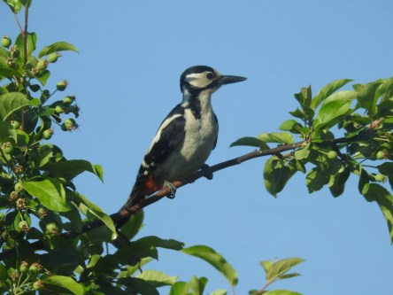
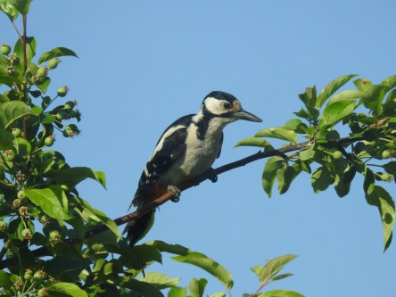

Idag går solen upp 04:18 och ned 21:39. Månen går upp 01:04 och ned 09:39 Månen är belyst 75 %. Dagens längd är 17 timmar och 21 minuter

 Klart 14,4 C  Vindstilla  Luftfuktighet 89 %  hPa 1007 Kl.01:50

 Klart 21,4 C  Vindby 3,4 m/s NE  Luftfuktighet 73 %  hPa 1004 Kl.07:10

 Växlande molnighet 33,7 C  Vindby 3,6 m/s NNW  Luftfuktighet 45 %  hPa 1003 Kl.14:40

 Växlande molnighet 21,8 C  Vindby 0,7 m/s SW  Luftfuktighet 67 %  hPa 1002 Kl.20:35

 Äntligen verkar det bli lite svalare väder.

Högst och lägst uppmätta temperatur igår (inofficiellt privat mätare): Max 40,8 C ( i solen ), Min 10,8 C Högst uppmätta vind 2,4 m/s. Högst uppmätta vindby 6,2 m/s

Högst och lägst uppmätta temperatur igår (officiellt enligt [YR.NO](http://www.vackertvader.se/v%C3%A4derstation/karlshamn?utm_source=email&utm_medium=email&utm_campaign=asarum)) Max 31,1 C, Min 10,4 C Högst uppmätta vind 3,7 m/s. Högst uppmätta vindby 8,8 m/s

 Mamma Hacke hade ne del problem med att hålla sig kvar på den här grenen i blåsten idag. Men jag lyckades fånga henne på bild ändå.
