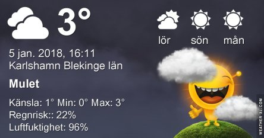
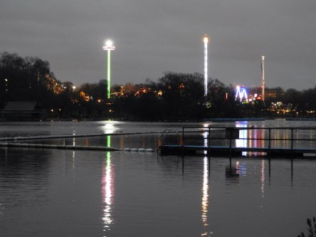

Idag går solen upp 08:31 och ned 15:40. Månen går upp 20:30 och ned 10:30 Månen är belyst 88 %. Dagens längd är 7 timmar och 9 minuter

 Molnigt 1,6 C  Vindstilla  Luftfuktighet 97 %  hPa 981 Kl.02:30

 Regn 1,7 C  Vindby 1,2 m/s NNW  Luftfuktighet 98 %  hPa 980  Regn 1,5 mm Kl.06:30

 Molnigt 5,1 C  Vindby 1,2 m/s NW  Luftfuktighet 97 %  hPa 985  Regn 2,7 mm Kl.14:50

 Mest molnigt 0.3 C  Vindstilla  Luftfuktighet 98 %  hPa 990 Kl.20:05

 Imorgon hoppas jag kunna få lite bilder på solen igen.

Högst och lägst uppmätta temperatur igår (inofficiellt privat mätare): Max 5,8 C , Min 2,5 C Högst uppmätta vind 1,4 m/s. Högst uppmätta vindby 2 m/s.

Högst och lägst uppmätta temperatur igår (officiellt enligt [YR.NO](http://www.vackertvader.se/v%C3%A4derstation/karlshamn?utm_source=email&utm_medium=email&utm_campaign=asarum)) Max 3,5 C, Min 2,4 C Högst uppmätta vind 1,7 m/s. Högst uppmätta vindby 4,6 m/s

 Det blir ytterligare en Londonbild idag. Den här gången en kvällsbild över Winter Wonderland sett från andra sidan sjön i Hyde Park. Imorgon hoppas jag kunna visa lite bilder på solen här hemma.
