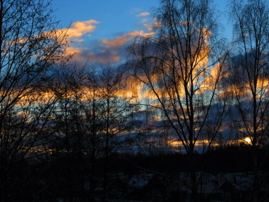

Idag går solen upp 07:49 och ned 16:41. Månen går upp 23:19 och ned 09:58 Månen är belyst 76 %. Dagens längd är 8 timmar och 52 minuter

 Klart  - 7,6 C  Vindby 1,8 m/s WSW  Luftfuktighet 82 %  hPa 1027 Kl.01:50

 Klart och kallt - 8,6 C  Vindby 2,2 m/s WNW  Luftfuktighet 76 %  hPa 1028 Kl.06:30

 Mest klart och soligt 2,7 ( i solen ) C  Vindby 1,2 m/s SE  Luftfuktighet 51 %  hPa 1026 Kl.15:00

 Klart och kallt - 10 C  Vindstilla  Luftfuktighet 77 %  hPa 1024 Kl.20:05

 Soligt men väldigt kallt idag.

Högst och lägst uppmätta temperatur igår (inofficiellt privat mätare): Max 2,5 C , Min – 6,7 C Högst uppmätta vind 3,1 m/s. Högst uppmätta vindby 6,2 m/s.

Högst och lägst uppmätta temperatur igår (officiellt enligt [YR.NO](http://www.vackertvader.se/v%C3%A4derstation/karlshamn?utm_source=email&utm_medium=email&utm_campaign=asarum)) Max 0,4 C, Min – 6,8 C Högst uppmätta vind 4,1 m/s. Högst uppmätta vindby 8,4 m/s

 Soluppgång idag.

 Och solnedgång idag.
