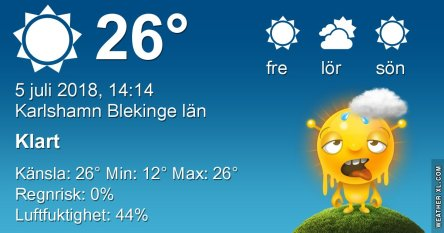
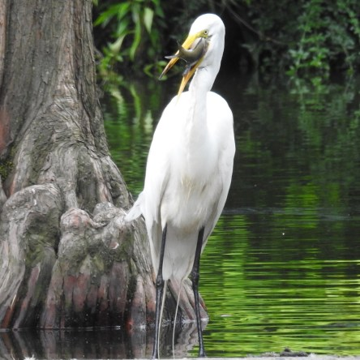
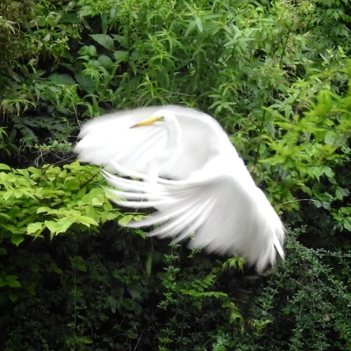

Idag går solen upp 04:21 och ned 21:49. Dagens längd är 17 timmar och 28 minuter. Det är gryning 03:20 och skymning 22:49 Det är dagsljus 19 timmar och 29 minuter. Månen går upp 00:41 och ned 12:02 Månen är belyst 63 %.

 Mest klart 14,9 C  Vindby 0,3 m/s N  Luftfuktighet 63 %  hPa 1005 Kl.01:25

 Mest klart 21,7 C  Vindby 2 m/s SW  Luftfuktighet 63 %  hPa 1005 Kl.07:30

 Klart 32,2 C  Vindby 2,2 m/s S  Luftfuktighet 36 %  hPa 1004 Kl.13:00

 Klart 21,4 C  Vindby 3,7 m/s NW  Luftfuktighet 50 %  hPa 1003 Kl.20:05

 Ännu en varm och snustorr dag läggs till alla de övriga.

Högst och lägst uppmätta temperatur igår (inofficiellt privat mätare): Max 37,5 C ( i solen ), Min 8,5 C Högst uppmätta vind 4,8 m/s. Högst uppmätta vindby 6,5 m/s

Högst och lägst uppmätta temperatur igår (officiellt enligt [YR.NO](http://www.vackertvader.se/v%C3%A4derstation/karlshamn?utm_source=email&utm_medium=email&utm_campaign=asarum)) Max 30,8 C, Min 8,7 C Högst uppmätta vind 3,5 m/s. Högst uppmätta vindby 9 m/s

 En rödvingetrupial vid Niagarafallen.

 En lyckligt lottad häger som fick napp i Central Park.

 Nöjd med sin middag så flyger han iväg.
