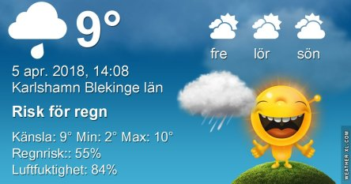
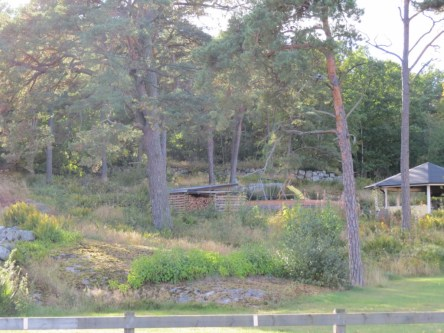
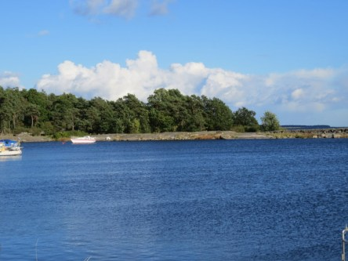
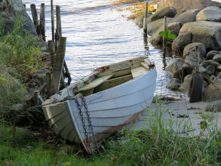
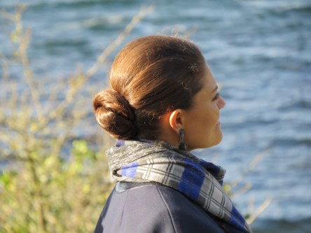

Idag går solen upp 06:21 och ned 19:46. Månen går upp 00:26 och ned 08:57 Månen är belyst 79 %. Dagens längd är 13 timmar och 25 minuter

 Regn 4,8 C  Vindby 0,8 m/s E  Luftfuktighet 97 %  hPa 995 Kl.02:15

 Molnigt 3,7 C  Vindstilla  Luftfuktighet 99 %  hPa 993  Regn 2,2 mm Kl.06:50

 Mest molnigt 13,7 C  Vindby 2 m/s N  Luftfuktighet 73 %  hPa 996 Kl.13:20

 Molnigt 6,9 C  Vindby 2,6 m/s S  Luftfuktighet 87 %  hPa 999 Kl.19:55

 Ännu en dag med tvåsiffrigt, men inte alls lika soligt och fint som igår.

Högst och lägst uppmätta temperatur igår (inofficiellt privat mätare): Max 19,6 ( i solen ) C , Min 1,2 C Högst uppmätta vind 3,1 m/s. Högst uppmätta vindby 5,4 m/s.

Högst och lägst uppmätta temperatur igår (officiellt enligt [YR.NO](http://www.vackertvader.se/v%C3%A4derstation/karlshamn?utm_source=email&utm_medium=email&utm_campaign=asarum)) Max 14,8 C, Min 1,7 C Högst uppmätta vind 3 m/s. Högst uppmätta vindby 6,4 m/s

 Idag får arkivet rycka in igen och den här gången blir det bilder från september 2014 när Kronprinsessan Viktoria invigde naturreservatet vid Boön i Karlshamn.

 Jag lyckades få en hel del bilder på henne. Jag har gjort ett inlägg tidigare om den här invigningen men väljer ändå att upprepa en del av bilderna.
