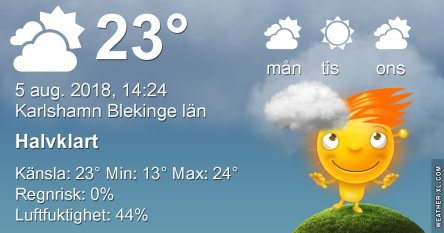
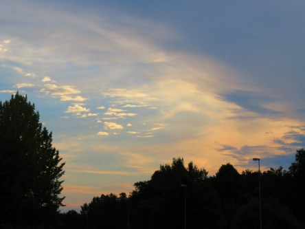

Idag går solen upp 05:11 och ned 21:01. Dagens längd är 15 timmar och 50 minuter. Det är gryning 04:23 och skymning 21:48 Det är dagsljus 17 timmar och 25 minuter. Månen går upp 00:00 och ned 14:29 Månen är belyst 57 %.

 Halvklart 14,3 C  Vindstilla  Luftfuktighet 87 %  hPa 1010 Kl.01:50

 Mest molnigt 20 C  Vindby 2,2 m/s NW  Luftfuktighet 73 %  hPa 1010 Kl.08:20

 Växlande molnighet och blåsigt 28,8 C  Vindby 7,5 m/s W  Luftfuktighet 35 %  hPa 1010 Kl.13:00

 Mest monigt 19,6 C  Vindby 1,6 m/s S  Luftfuktighet 48 %  hPa 1010 Kl.19:55

 Det fläktar en hel del idag och är någon grad svalare, men fortfarande varmt.

Högst och lägst uppmätta temperatur igår (inofficiellt privat mätare): Max 33,2 C ( i solen ), Min 11,3 C Högst uppmätta vind 3,4 m/s. Högst uppmätta vindby 5 m/s

Högst och lägst uppmätta temperatur igår (officiellt enligt [YR.NO](http://www.vackertvader.se/v%C3%A4derstation/karlshamn?utm_source=email&utm_medium=email&utm_campaign=asarum)) Max 28,9 C, Min 13,6 C Högst uppmätta vind 4,1 m/s. Högst uppmätta vindby 10,1 m/s

 Lördagens soluppgång. Det var mycket moln och svalt och skönt. Sen blev det som vanligt stekhett igen.
