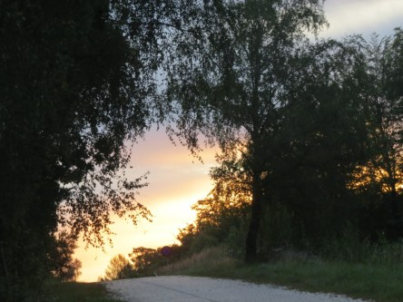
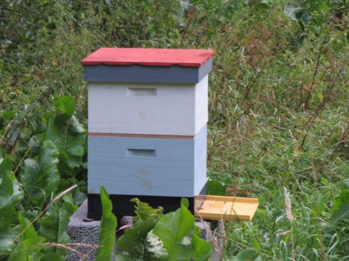

Idag går solen upp 06:12 och ned 19:45. Dagens längd är 13 timmar och 33 minuter. Det är gryning 05:33 och skymning 20:24 Det är dagsljus 14 timmar och 51 minuter. Månen går upp 00:25 och ned 17:21 Månen är belyst 28 %.

 Mest klart 9,3 C  Vindstilla  Luftfuktighet 98 %  hPa 1016 Kl.02:20

 Tunna slöjmoln 8,4 C  Vindstilla  Luftfuktighet 99 %  hPa 1016 Kl.06:45

 Växlande 25,3 C  Vindby 2 m/s SSE  Luftfuktighet 58 %  hPa 1016 Kl.13:35

 Molnigt 16,5 C  Vindstilla  Luftfuktighet 81 %  hPa 1016 Kl.20:10

 Idag har det varit väldigt varmt igen. Men en kall natt.

Högst och lägst uppmätta temperatur igår (inofficiellt privat mätare): Max 29,4 C ( i solen ), Min 8,2 C Högst uppmätta vind 2 m/s. Högst uppmätta vindby 2,7 m/s

Högst och lägst uppmätta temperatur igår (officiellt enligt [YR.NO](http://www.vackertvader.se/v%C3%A4derstation/karlshamn?utm_source=email&utm_medium=email&utm_campaign=asarum)) Max 23,1 C, Min 8 C Högst uppmätta vind 3,3 m/s. Högst uppmätta vindby 5,7 m/s

 En salig blandning från arkivet.
