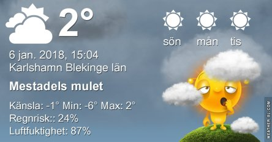
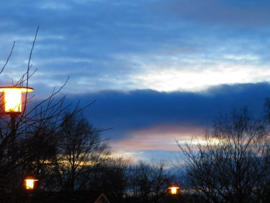

Idag går solen upp 08:31 och ned 15:42. Månen går upp 21:51 och ned 10:55 Månen är belyst 79 %. Dagens längd är 7 timmar och 11 minuter

 Växlande molnighet 0,1 C  Vindstilla  Luftfuktighet 99 %  hPa 994 Kl.01:40

 Molnigt 0,5 C  Vindstilla  Luftfuktighet 99 %  hPa 996 Kl.07:55

 Molnigt 4,7 C  Vindstilla  Luftfuktighet 97 %  hPa 1001 Kl.13:45

 Mest klart - 2 C  Vindby 2,8 m/s W  Luftfuktighet 77 %  hPa 1009 Kl.19:55

 Av solen såg vi intet idag. Får se om hon behagar visa sig imorgon istället.

Högst och lägst uppmätta temperatur igår (inofficiellt privat mätare): Max 5,1 C , Min - 1,7 C Högst uppmätta vind 1 m/s. Högst uppmätta vindby 2 m/s.

Högst och lägst uppmätta temperatur igår (officiellt enligt [YR.NO](http://www.vackertvader.se/v%C3%A4derstation/karlshamn?utm_source=email&utm_medium=email&utm_campaign=asarum)) Max ? C, Min ? C Högst uppmätta vind ? m/s. Högst uppmätta vindby ? m/s

 Ingen sol idag heller.

 Till slut blev det en liten lucka i molntäcket trots allt.
