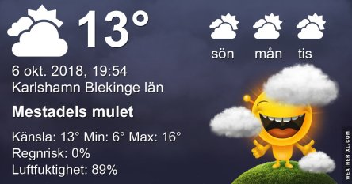
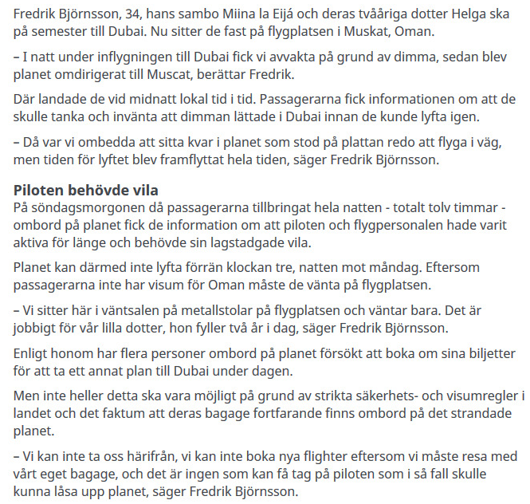
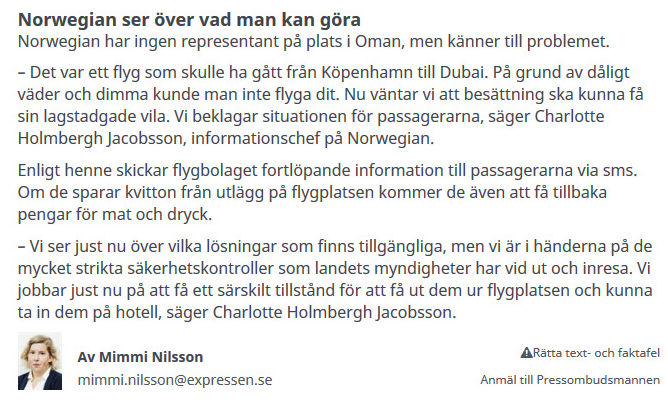
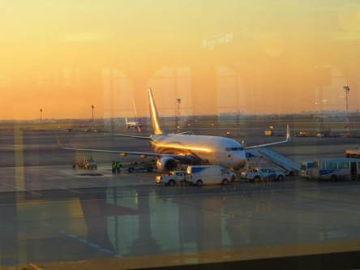
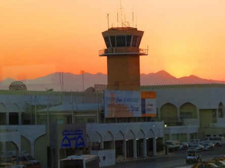
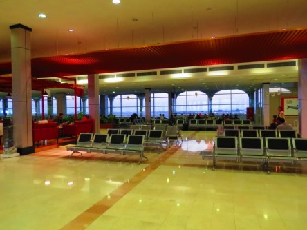
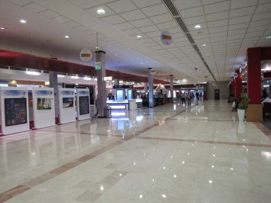
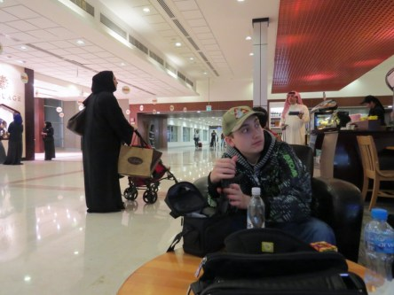

Idag går solen upp 07:13 och ned 18:23. Dagens längd är 11 timmar och 10 minuter. Det är gryning 06:36 och skymning 19:00 Det är dagsljus 12 timmar och 24 minuter. Månen går upp 03:09 och ned 17:50 Månen är belyst 12 %.

 Halvklart 5,2 C  Vindstilla  Luftfuktighet 97 %  hPa 1009 Kl.02:15

 Halvklart 3,8 C  Vindstilla  Luftfuktighet 99 %  hPa 1006 Kl.06:35

 Mest molnigt 19,5 C  Vindby 2,4 m/s E  Luftfuktighet 65 %  hPa 1005 Kl.14:05

 Mest molnigt 8,5 C  Vindby 0,3 m/s SW  Luftfuktighet 93 %  hPa 1004 Kl.19:55

 Idag hade vi en härlig brittsommardag.

Högst och lägst uppmätta temperatur igår (inofficiellt privat mätare): Max 17,2 C , Min 7,5 C Högst uppmätta vind 3,4 m/s, Högst uppmätta vindby 5,1 m/s

Högst och lägst uppmätta temperatur igår (officiellt enligt [YR.NO](http://www.vackertvader.se/v%C3%A4derstation/karlshamn?utm_source=email&utm_medium=email&utm_campaign=asarum)) Max 15,5 C, Min 5,9 C Högst uppmätta vind 2,4 m/s. Högst uppmätta vindby 5,6 m/s

#### **Det här är historien om vår första resa till Dubai och allt vad den förde med sig!**

 Ibland blir det inte riktigt som man har tänkt sig!

Vi såg fram emot att vår dröm om Dubai äntligen skulle gå i uppfyllelse och glada gav vi oss iväg till vårt livs äventyr. Och ett äventyr blev det verkligen! Allt gick hur bra som helst hela vägen till Dubai och vi anlände dit punktligt. Men där tog turen stopp. Vi fick veta ett det var tjock dimma i Dubai och att vi inte fick tillstånd att landa utan vi skulle få cirkla över havet en stund tills dimman lättat så pass mycket att skulle gå att landa. Så långt var ju allt ok. Det är sånt man får räkna med när man flyger, så det kändes inte som något större problem. Problem blev det dock gott om senare. Att cirkla runt i luften som vi gjorde där kostar bränsle och efter ungefär en timme så fick vi veta att tanken började bli tom och att vi måste söka efter en flygplats som kunde ge oss tillstånd att landa och tanka. Det visade sig att det var många plan som var i samma sits så vi blev dirigerade till olika flygplatser i närheten och vi hamnade i Muscat i Oman. Det var ungefär en timmes flygning dit så vi satte kurs mot Oman. Än så länge höll vi modet uppe för vi trodde att vi snart skulle vara i Dubai och börja vårt äventyr. Men ack så fel det visade sig vara. Väl i Muscat så fick vi ställa oss i kö för att få tanken fylld. Och den kön visade sig vara lång. Timmarna gick och vi började bli allt mer oroliga och trötta. Det var dåligt med information om vad som hände och alla stackars små barn som var med började bli ordentligt ledsna och trötta. De grät och skrek och de stackars föräldrarna gjorde allt de kunde för att trösta och hålla dem lugna. Det var nu riktigt varmt inne i planet eftersom det inte var igång och inga fläktar fungerar då. Ute var det 35 grader varmt så det behövs ingen större fantasi för att förstå hur varmt det blev där inne i ett fullsatt plan. Och timmarna gick. Alla blev både hungriga och törstiga, men ville vi ha något så fick vi köpa det och det var inte billigt. Vi köpte vatten för hundratals kronor under de timmar vi satt där. Efter mycket om och men fick vi veta att vi skulle bli tvungna att övernatta i Oman och att de skulle försöka ordna hotellrum åt oss. Nu började vi bli riktigt trötta och oroliga. Dimman var fortfarande tjock i Dubai och de kunde inte garantera att vi överhuvudtaget skulle komma dit! Så paniken spred sig och svetten lackade i det heta planet. Jag fick riktig panik och reste mig för att ställa mig i dörröppningen på planet och få lite luft. Jag tog ett steg ut på trappen ner från planet, men det skulle jag aldrig ha gjort. Jag blev tillsagd att genast gå in igen för vi fick inte sätta vår fot utanför planet eftersom vi inte hade visum till Oman. Så det var bara att trava in i den nu outhärdliga värmen inne i planet igen. Barnen var otröstliga nu och alla började få mer eller mindre panik. Och nu fick vi veta att vi inte skulle få något hotellrum heller eftersom vi inte hade visum och det skulle ta för lång tid att ordna det åt alla. Timmarna gick och vi svettades och började ilskna till ordentligt. Den stackars flygplansbesättningen gjorde allt de kunde för det skulle bli någorlunda uthärdligt. Och nu äntligen bestämdes det att vi skulle få något att äta och dricka, men det visade sig att det fanns nästan inget vatten kvar så vi fick varsin liten mugg och någon lite kexbit till. Jag kommer inte riktigt ihåg vad det var men det var inget man blev mätt av i alla fall. Efter en evighets väntan fick vi veta att vi skulle få gå av planet och få mat och vila inne i terminalen. För nu visade det sig att piloten och övriga besättningen inte fick flyga mer det dygnet innan de fått sin vila på åtta timmar!. Och det skulle ordnas visum åt dem eftersom deras vila inte kunde börja räknas förren de lämnat planet. Så nu fick vi vänta på att vi skulle kunna lämna planet och få mat i terminalen. Då uppstod nästa problem. Vi fick ju inte gå på deras mark utan visum. Så hur skulle vi kunna ta oss till terminalen då? Det löste de genom att ordna poliseskort till en buss som stod tre steg från planet och som skulle ta oss de 150 metrarna till terminalen!!!! Och naturligtvis tog även detta tid. Efter att ha cirklat över havet i en timme och sedan flugit till Oman, vilket tog ytterligare en timme, och sedan suttit instängda i ett glödhett plan praktiskt taget utan mat och vatten i åtta timmar på marken så fick vi äntligen lämna planet och eskorteras till terminalen där vi blev lovade två mål mat och möjlighet att vila. Så alla blev lättade och kunde inte vänta på att få lämna planet. Nu var alla tankar på Dubai tillfälligt borta och det enda som gällde var mat och sömn. Väl inne på terminalen var det en lång procedur med kontroller och information om vad som skulle hända och det tog tid innan vi äntligen kunde få våra matkuponger, som visade sig enbart gälla hamburgare och pommes på två utvalda restauranger typ Mc Donalds! Det var inte riktigt vad man längtade efter i det läget. Men nu var vi så hungriga att vi nästan hade ätit vad som helst. Så det var bara till att ställa sig i kön, som var låååång, och vänta på att få mat. Sen började jakten på den utlovade vilan som visade sig vara att välja mellan att sitta på metallbänkar eller att lägga sig på golvet utan vare sig filtar eller annat som underlag. Snacka om att vi blev knäckta! Det fanns några få stoppade fåtöljer som det blev gatlopp till för få sitta lite bekvämare. Så där satt vi och såg solen gå både upp och ner. När vi skulle hämta vårt andra mål mat så visade det sig att vi inte fick något mer mål. De hade dragit in det för oss. Att vi fick mat överhuvudtaget var på grund av flygplatsens goda vilja sa de och den goda viljan tog tydligen slut efter en hamburgare. Så ville vi ha mer mat fick vi köpa det. Så nu var vi inte på gott humör någonstans kan jag säga. Och för att spola fram händelserna lite så visade sig vår väntan på terminalen bli 15 timmar lång innan vi äntligen kunde sätta oss på planet igen och styra kosan mot Dubai. Men tro inte för en sekund att vår otur var slut i och med det. Det skulle hända mycket mer på den resan och fortsättningen kommer imorgon för den som vill läsa den.

 Solen går upp över flygplatsen i Oman.

 Här tillbringade vi 15 timmar i väntan på att komma till Dubai!
