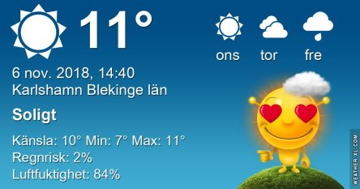
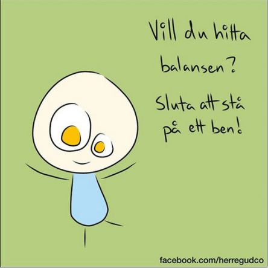
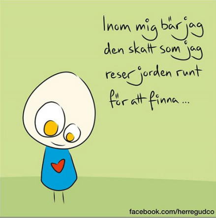
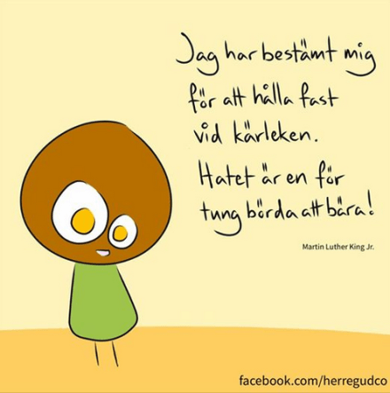

Idag går solen upp 07:19 och ned 16:09 Dagens längd är 8 timmar och 50 minuter. Det är gryning 06:38 och skymning 16:50 Det är dagsljus 10 timmar och 12 minuter. Månen går upp 05:15 och ned 16:13 Månen är belyst 3 %.

 Molnigt 9,7 C  Vindby 2,4 m/s N  Luftfuktighet 93 %  hPa 1010 Kl.02:20

 Molnigt och lätt dimma 7,2 C  Vindby 1,4 m/s NW  Luftfuktighet 93 %  hPa 1008 Kl.06:55

 Tunna moln 13,8 C  Vindby 3,7 m/s NW  Luftfuktighet 70 %  hPa 1008 Kl.14:10

 Dimma  2,9 C  Vindby 0,3 m/s SW  Luftfuktighet 93 %  hPa 1010 Kl.21:00

 Värmen håller i sig. Ingen kyla i sikte! Härligt.

Högst och lägst uppmätta temperatur igår (inofficiellt privat mätare): Max 10,6 C , Min 7,8 C Högst uppmätta vind 1,4 m/s, Högst uppmätta vindby 2,4 m/s

Högst och lägst uppmätta temperatur igår (officiellt enligt [YR.NO](http://www.vackertvader.se/v%C3%A4derstation/karlshamn?utm_source=email&utm_medium=email&utm_campaign=asarum)) Max 9,7 C, Min 8,4 C Högst uppmätta vind 2,6 m/s. Högst uppmätta vindby 5,2 m/s

 Idag blir det fler kloka ord eftersom jag har ostressat hela dagen.
