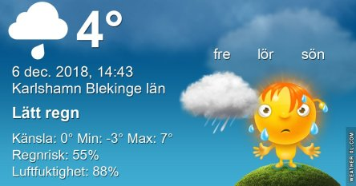

Idag går solen upp 08:16 och ned 15:27 Dagens längd är 7 timmar och 11 minuter. Det är gryning 07:30 och skymning 16:13 Det är dagsljus 8 timmar och 43 minuter. Månen går upp 06:51 och ned 15:24 Månen är belyst 5 %.

 Mest molnigt - 4,1 C  Vindstilla  Luftfuktighet 83 %  hPa 1016 Kl.02:35

 Molnigt 1,1 C  Vindby 1,4 m/s ENE  Luftfuktighet 88 %  hPa 1013 Kl.06:40

 Molnigt 5,8 C  Vindby 3,4 m/s NW  Luftfuktighet 78 %  hPa 1010 Kl.13:30

 Molnigt 3,6 C  Vindby 1,6 m/s E  Luftfuktighet 92 %  hPa 1005  Regn 2,7 mm Kl.19:50

 Ännu en extremt grå och tråkig dag

Högst och lägst uppmätta temperatur igår (inofficiellt privat mätare) Max 7,7 C , Min - 5,2 C Högst uppmätta vind 2,7 m/s, Högst uppmätta vindby 3,7 m/s

Högst och lägst uppmätta temperatur igår (officiellt enligt [YR.NO](http://www.vackertvader.se/v%C3%A4derstation/karlshamn?utm_source=email&utm_medium=email&utm_campaign=asarum)) Max 3,6 C, Min - 4,1 C Högst uppmätta vind 1,6 m/s. Högst uppmätta vindby 13,9 m/s

\[gallery type="rectangular" link="file" size="medium" ids="25797,25798,25799,25800,25801,25803,25804"\]

I det här gråa tråkiga vädret behövs det lite kloka ord som piggar upp.
