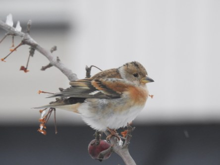
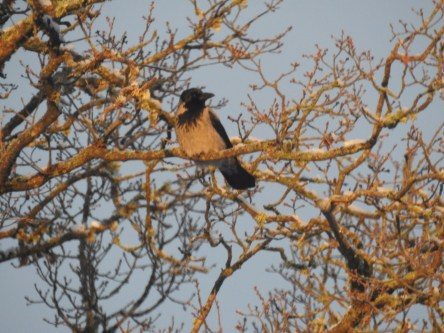
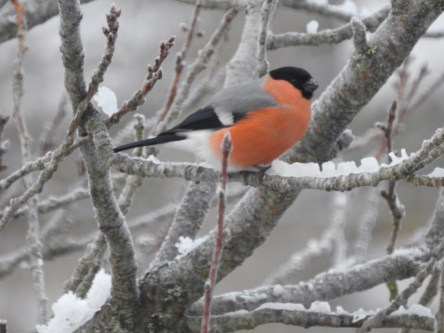

Idag går solen upp 07:47 och ned 16:43. Månen går upp 23:19 och ned 10:18 Månen är belyst 66 %. Dagens längd är 8 timmar och 56 minuter

 Klart och kallt - 13,5 C  Vindstilla  Luftfuktighet 83 %  hPa 1019 Kl.02:05

 Klart och kallt - 15,2 C  Vindstilla  Luftfuktighet 77 %  hPa 1015 Kl.06:50

 Molnigt - 1,8 C  Vindby 1,4 m/s WNW  Luftfuktighet 71 %  hPa 1012 Kl.14:20

 Växlande molnighet - 5,3 C  Vindby 1 m/s NE  Luftfuktighet 70 %  hPa 1011 Kl.21:00

 Iskallt och lite sol men mest mulet idag.

Högst och lägst uppmätta temperatur igår (inofficiellt privat mätare): Max 4,4 ( i solen ) C , Min – 12 C Högst uppmätta vind 1,4 m/s. Högst uppmätta vindby 2,7 m/s.

Högst och lägst uppmätta temperatur igår (officiellt enligt [YR.NO](http://www.vackertvader.se/v%C3%A4derstation/karlshamn?utm_source=email&utm_medium=email&utm_campaign=asarum)) Max - 1,8 C, Min – 12,9 C Högst uppmätta vind 2,6 m/s. Högst uppmätta vindby 5,3 m/s

 Bergfinkarna invaderar trädgården.

 En kråka njuter i solnedgången.

 Med kylan och vintern fick vi äntligen besök av domherren igen.
