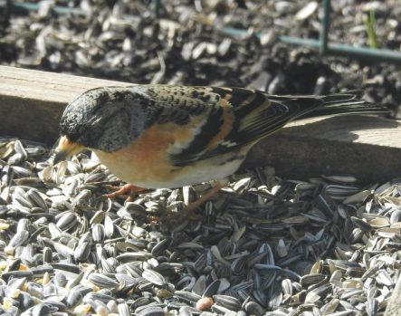
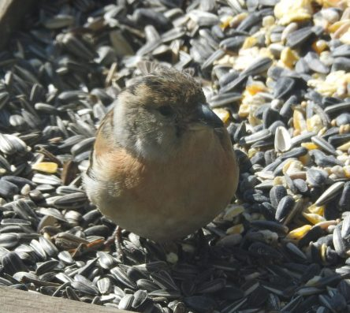
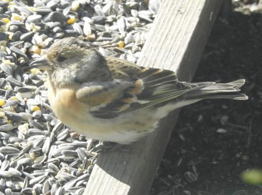
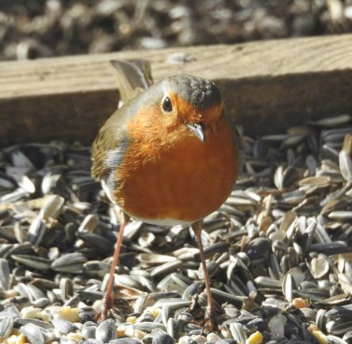

Idag går solen upp 06:19 och ned 19:49. Månen går upp 01:30 och ned 09:31 Månen är belyst 70 %. Dagens längd är 13 timmar och 30 minuter

 Halvklart 0,7 C  Vindby 6,8 m/s NW  Luftfuktighet 64 %  hPa 1004 Kl.02:20

 Molnigt och blåsigt 2,6 C  Vindby 6 m/s ENE  Luftfuktighet 68 %  hPa 1006 Kl.06:35

 Soligt och blåsigt 13,9 C  Vindby 6 m/s ENE  Luftfuktighet 33 %  hPa 1012 Kl.13:05

 Tunna slöjmoln 4,2 C  Vindby 1,8 m/s SSE  Luftfuktighet 46 %  hPa 1018 Kl.20:00

 Idag har det varit "full storm"här med vindar över 10 m/s.

Högst och lägst uppmätta temperatur igår (inofficiellt privat mätare): Max 13,9 C , Min 3,6 C Högst uppmätta vind 4,4 m/s. Högst uppmätta vindby 7,5 m/s.

Högst och lägst uppmätta temperatur igår (officiellt enligt [YR.NO](http://www.vackertvader.se/v%C3%A4derstation/karlshamn?utm_source=email&utm_medium=email&utm_campaign=asarum)) Max 10 C, Min 2,4 C Högst uppmätta vind 5 m/s. Högst uppmätta vindby 13,1 m/s

 Bergfinkar och rödhake njuter av solen och vårens ankomst.
