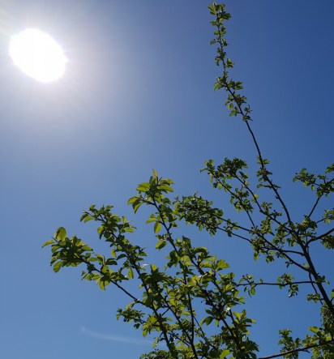

Idag går solen upp 05:05 och ned 20:49. Månen går upp 01:55 och ned 09:47 Månen är belyst 69 %. Dagens längd är 15 timmar och 44 minuter

 Mest klart 4,6 C  Vindstilla  Luftfuktighet 90 %  hPa 1023 Kl.02:25

 Tunna slöjmoln 16,3 C  Vindby 0,7 m/s N  Luftfuktighet 62 %  hPa 1024 Kl07:25

 Tunna slöjmoln 28,2 C ( i solen ) Vindby 5,1 m/s W  Luftfuktighet 38 %  hPa 1023 Kl.13:35

 Tunna slöjmoln 16,4 C  Vindby 1,4 m/s WSW   Luftfuktighet 55 %  hPa 1021 Kl.20:00

 Idag har det varit högsommar. Riktigt varmt och soligt. Äntligen.

Högst och lägst uppmätta temperatur igår (inofficiellt privat mätare): Max 27,2 C ( i solen ) , Min 2 C Högst uppmätta vind 3,7 m/s. Högst uppmätta vindby 5,4 m/s.

Högst och lägst uppmätta temperatur igår (officiellt enligt [YR.NO](http://www.vackertvader.se/v%C3%A4derstation/karlshamn?utm_source=email&utm_medium=email&utm_campaign=asarum)) Max 17,6 C, Min 1,8 C Högst uppmätta vind 3,6 m/s. Högst uppmätta vindby 9,3 m/s

 En helt underbar dag med sol och värme.
