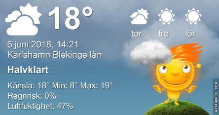
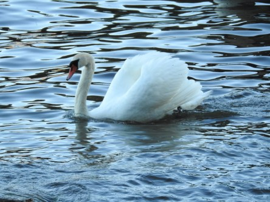
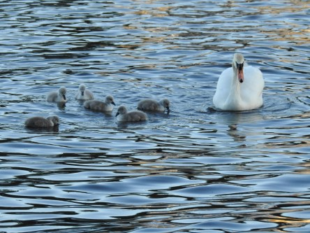

Idag går solen upp 04:16 och ned 21:42. Månen går upp 01:51 och ned 11:57 Månen är belyst 57 %. Dagens längd är 17 timmar och 26 minuter

 Klart 6,1 C  Vindby 0,3 m/s NW  Luftfuktighet 87 %  hPa 1015 Kl.01:35

 Växlande molnighet 10,5 C  Vindby 1,4 m/s W  Luftfuktighet 91 %  hPa 1016 Kl.06:45

 Molnigt 24,8 C  Vindby 7,6 m/s ESE  Luftfuktighet 47 %  hPa 1016 Kl.14:15

 Halvklart 14,2 C  Vindby 0,8 m/s WNW  Luftfuktighet 64 %  hPa 1015 Kl.21:05

 Idag har det varit behagligt varmt och blåsigt.

Högst och lägst uppmätta temperatur igår (inofficiellt privat mätare): Max 26,9 C ( i solen ), Min 8,3 C Högst uppmätta vind 3,1 m/s. Högst uppmätta vindby 5,1 m/s

Högst och lägst uppmätta temperatur igår (officiellt enligt [YR.NO](http://www.vackertvader.se/v%C3%A4derstation/karlshamn?utm_source=email&utm_medium=email&utm_campaign=asarum)) Max 21,4 C, Min 5,9 C Högst uppmätta vind 4,4 m/s. Högst uppmätta vindby 9,4 m/s

 Ikväll begav jag mig till havet för att ta lite bilder och stötte på denna vackra svanfamilj. De fick ett blått skimmer i kvällsljuset. Det var rejält blåsigt och kallt ikväll. Inte alls som man är van vid efter den långa värmeböljan.
