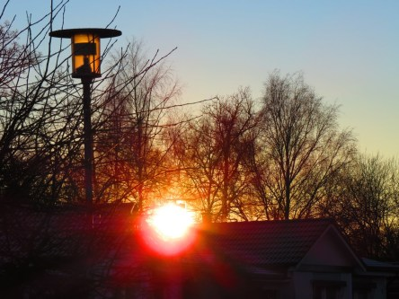
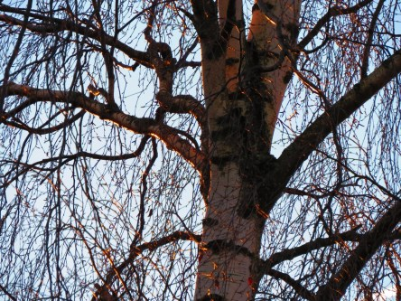

Idag går solen upp 08:30 och ned 15:43. Månen går upp 23:09 och ned 11:16 Månen är belyst 70 %. Dagens längd är 7 timmar och 13 minuter

 Klart - 5,6 C  Vindby 1,8 m/s NW  Luftfuktighet 82 %  hPa 1017 Kl.01:25

 Klart - 8,3 C  Vindstilla  Luftfuktighet 87 %  hPa 1022 Kl.06:45

 Klart och soligt 3,4 C  Vindby 1 m/s NE  Luftfuktighet 58 %  hPa 1026 Kl.13:10

 Klart - 8 C  Vindstilla  Luftfuktighet 85 %  hPa 1027 Kl.19:45

 Äntligen en solig dag. Väldigt uppiggande. Men med sol kommer kylan också. Men det är det värt just nu.

Högst och lägst uppmätta temperatur igår (inofficiellt privat mätare): Max 4,7 C , Min – 5,3 C Högst uppmätta vind 2,7 m/s. Högst uppmätta vindby 4,4 m/s.

Högst och lägst uppmätta temperatur igår (officiellt enligt [YR.NO](http://www.vackertvader.se/v%C3%A4derstation/karlshamn?utm_source=email&utm_medium=email&utm_campaign=asarum)) Max 2,3 C, Min - 2,9 C Högst uppmätta vind 3,9 m/s. Högst uppmätta vindby 9,1 m/s

 Sol och blå himmel!
