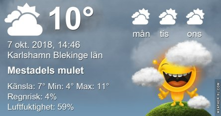
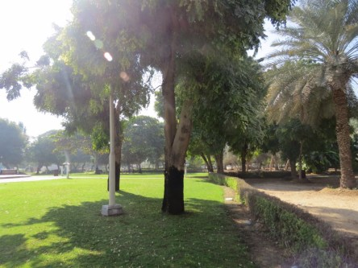
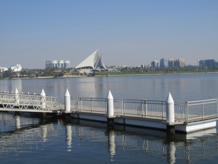
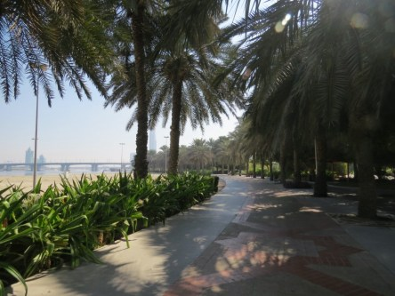
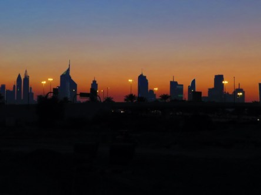
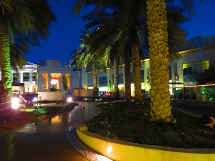

Idag går solen upp 07:15 och ned 18:20. Dagens längd är 11 timmar och 05 minuter. Det är gryning 06:38 och skymning 18:58 Det är dagsljus 12 timmar och 20 minuter. Månen går upp 04:29 och ned 18:12 Månen är belyst 6 %.

 Mest molnigt 7,2 C  Vindstilla  Luftfuktighet 97 %  hPa 1004 Kl.01:20

 Molnigt 7,1 C  Vindby 3,4 m/s SSW  Luftfuktighet 98 %  hPa 1005  Regn 7 mm Kl.06:20

 Mest molnigt 13,3 C  Vindby 2,7 m/s S  Luftfuktighet 59 %  hPa 1012  Regn 12,7 mm Kl.13:55

 Mest klart 2,6 C  Vindstilla  Luftfuktighet 92 %  hPa 1016 Kl.19:55

 Äntligen fick vi lite mer regn. 12,7 mm!

Högst och lägst uppmätta temperatur igår (inofficiellt privat mätare): Max 22,3 C , Min 3,7 C Högst uppmätta vind 1,7 m/s, Högst uppmätta vindby 2,7 m/s

Högst och lägst uppmätta temperatur igår (officiellt enligt [YR.NO](http://www.vackertvader.se/v%C3%A4derstation/karlshamn?utm_source=email&utm_medium=email&utm_campaign=asarum)) Max 17,2 C, Min 2,8 C Högst uppmätta vind 2,5 m/s. Högst uppmätta vindby 4,9 m/s

### **Fortsättningen på vår otursdrabbade Dubairesa följer här.**

Efter att ha tillbringat 15 timmar i terminalen fick vi äntligen besked om att vi fått tillstånd att lyfta och landa i Dubai. Dötrötta och hungriga blev vi eskorterade ner till gaten för vårt flyg. Och där väntade ännu mer väntande. Men nu kände vi att vi åtminstone var på rätt väg igen. Så när vi äntligen fick gå ombord på planet som skulle ta oss till Dubai så var vi så lyckliga så allt annat hamnade i skymundan. Den här gången flöt allt på bra och lite mer än en timme senare landande vi Dubai och nu gällde det att ta sig till hotellet så fort som möjligt. Vi fick tag på en taxi som körde oss till dörren och äntligen så var vi där vi skulle vara! Problemet var att nu var klockan sju på morgonen och vi hade förlorat en hel dag av vår vecka i Dubai, så vi kände att vi inte kunde kosta på oss att sova nu utan det var till att checka in och ta en snabb dusch och sen ut på stan för att hitta något att äta. På hotellet var de väldigt trevliga och vi blev bemötta som kungar medans vi väntade på vårt rum. Vi blev serverade en drink ( alkoholfri, klockan var ju bara sju på morgonen trots allt ) och ett litet tilltugg. Sen gick allt bra resten av vår vistelse i Dubai. Vi flög helikopter över stan och vi var uppe i världens högsta byggnad, Burj Khalifa, och vi åkte hop on hop off buss både på dagen och kvällen. Så så långt hade turen vänt sig på vår sida. Men sista dagen började problemen igen. Vi hade bokat en ökensafari med flerrätters middag i ett beduinläger och kamelridning. Det här var höjdpunkten på vår resa och ett perfekt slut tyckte vi. Vi skulle bli upphämtade vid hotellet vid tretiden på eftermiddagen och körda till öknen där kamelerna väntade på att ta oss ut till lägret. Så vi tog oss hem till hotellet i god tid och duschade och gick ner till lobbyn och väntade. Klockan gick och vi började undra om de glömt bort oss. Så vi bad personalen i lobbyn att hjälpa oss att ringa chauffören. Då fick vi ett lugnande besked att han satt fast i trafiken men snart skulle vara vid vårt hotell. Så vi fortsatte att vänta, vi hade ju blivit rätt vana vid det vid det här laget. Men klockan gick och nu började det bli kris för kamelkaravanen kunde inte vänta om vi kom för sent. Då skulle alla andra också komma iväg för sent och missa en stor del av turen. Så vi ringde arrangören och frågade var vår chaufför tagit vägen. De visste ingenting men skulle kolla upp vad som hänt. En kvart senare så ringde telefonen och det var arrangören som hade fått besked om vad som hänt. Chauffören hade krockat och bilen var okörbar!!! Dessutom hade de ingen som kunde ersätta honom. Alternativet för oss var att han fick hämta en annan bil men då skulle han inte hinna i tid till kamelturen skulle gå. Vi skulle missa det mesta av turen då eftersom de i så fall fick köra ut oss till lägret i en jeep istället och den skulle inte hinna fram i tid till underhållningen. Så där står vi snopna och besvikna och inser att det inte blir någon ökentur för vår del. Vi blev visserligen erbjudna att boka en ny dag eller en annan tur vilken dag som helst, men vad hjälpte det när vi skulle åka hem dagen efter och det inte fanns tid för ombokning. Så besvikna fick vi strosa runt kring hotellet resten av dagen och sen gå upp och packa inför hemfärden dagen efter. Och nu kan man tycka att det inte kan gå mer fel på en och samma resa, men tro mig, det kan det! Om det berättar jag imorgon i den avslutande delen i den här serien om vår Dubairesa.

 Trots alla missöden vi råkade ut för så blev vi väldigt förälskade i Dubai. Det går inte att få nog av det här landet och även om man kan läsa mycket negativt om hur hårda och strikta lagar de har där så är det inget vi märkte av. Det det handlar om är att respektera deras lagar och inte utmana dem genom att bete sig på ett sätt som de inte tillåter. Man tar seden dit man kommer. En stor fördel i Dubai är att brottsligheten är näst intill noll. Som turist är man aldrig rädd i Dubai, varken dagtid eller kvällstid. Stölder förekommer i stort sett inte där. Vi glömde Jonas Ipad i en park efter att vi suttit och vilat en stund. En timme senare kom vi på att den var borta och vi sprang tillbaka till den bänk vi suttit på. Och där var plattan. Ingen hade rört den. Dessutom är alla väldigt vänliga och hjälpsamma. Jag har bara gott att säga om Dubai och skulle gärna åka dit igen trots att vi varit där två gånger.
