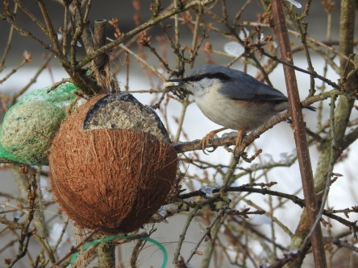
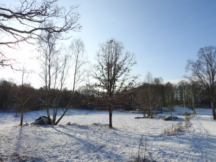

Idag går solen upp 07:45 och ned 16:45. Månen går upp 00:32 och ned 10:38 Månen är belyst 56 %. Dagens längd är 9 timmar och 0 minuter

 Halvklart och kallt - 11,5 C  Vindstilla  Luftfuktighet 81 %  hPa 1012 Kl.01:05

 Mest klart - 14,1 C  Vindstilla  Luftfuktighet 77 %   hPa 1012 Kl.06:35

 Växlande molnighet 4,7 C  ( i solen )  Vindby 1 m/s NE  Luftfuktighet 53 %  hPa 1013 Kl.12:25

 Mest klart - 4,8 C  Vindby 0,8 m/s ESE  Luftfuktighet 68 %  hPa 1014 Kl.19:50

 Ytterligare en kall natt med en solig dag som följd.

Högst och lägst uppmätta temperatur igår (inofficiellt privat mätare): Max - 1,8 C , Min – 15,3 C Högst uppmätta vind 2 m/s. Högst uppmätta vindby 3,1 m/s.

Högst och lägst uppmätta temperatur igår (officiellt enligt [YR.NO](http://www.vackertvader.se/v%C3%A4derstation/karlshamn?utm_source=email&utm_medium=email&utm_campaign=asarum)) Max - 4 C, Min – 14,4 C Högst uppmätta vind 2,2 m/s. Högst uppmätta vindby 5,5 m/s

 Gäster i trädgården idag. Nötväcka och Stenknäck.

 Och idag blev det äntligen väder för en skogspromenad med kameran.
