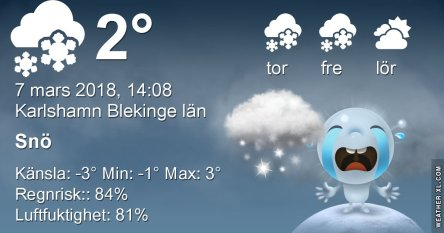
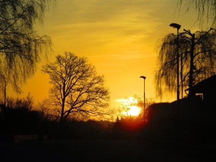
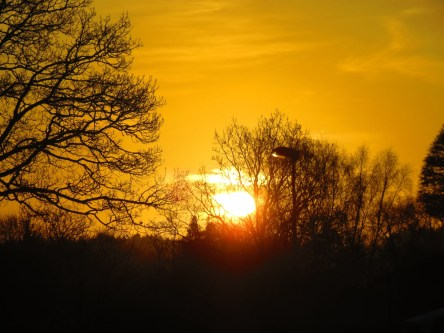

Idag går solen upp 06:38 och ned 17:46. Månen går upp 23:24 och ned 09:03 Månen är belyst 73 %. Dagens längd är 11 timmar och 8 minuter

 Halvklart - 2,1 C  Vindby 2,2 m/s NE  Luftfuktighet 86 %  hPa 993 Kl.01:55

 Molnigt - 2 C  Vindby 2 m/s NE  Luftfuktighet 86 %  hPa 991 Kl.06:35

 Molnigt 4,6 C  Vindby 3,6 m/s ENE  Luftfuktighet 66 %  hPa 992 Kl.13:50

 Molnigt 0,5 C  Vindby 1 m/s SE  Luftfuktighet 84 % hPa 992 Kl.20:00

 Grått och trist men nu blir det varmare äntligen.

Högst och lägst uppmätta temperatur igår (inofficiellt privat mätare): Max 11 C ( i solen ), Min – 2,4 C Högst uppmätta vind 1,7 m/s. Högst uppmätta vindby 4,4 m/s.

Högst och lägst uppmätta temperatur igår (officiellt enligt [YR.NO](http://www.vackertvader.se/v%C3%A4derstation/karlshamn?utm_source=email&utm_medium=email&utm_campaign=asarum)) Max 5,5 C, Min – 2 C Högst uppmätta vind 3,5 m/s. Högst uppmätta vindby 6,5 m/s

 Soluppgång för ett år sedan. Jag ser fram emot när jag kan ta nya bilder på soluppgångar igen.
