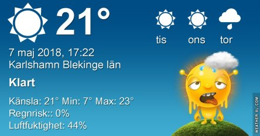
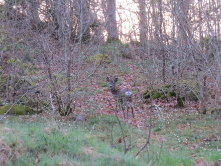
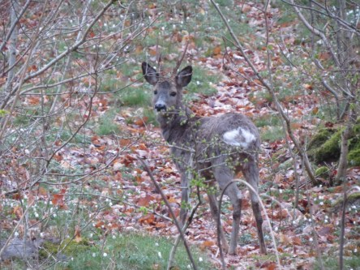
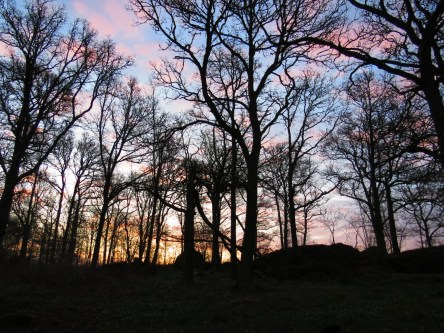
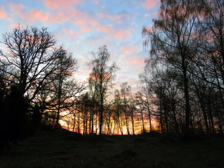

Idag går solen upp 05:03 och ned 20:51. Månen går upp 02:31 och ned 10:48 Månen är belyst 60 %. Dagens längd är 15 timmar och 48 minuter

 Klart 4,9 C  Vindstilla  Luftfuktighet 96 %  hPa 1021 Kl.01:40

 Klart 15,4 C  Vindstilla  Luftfuktighet 58 %  hPa 1020 Kl.07:35

 Klart 29,3 C ( i solen )  Vindby 2,8 m/s SSE  Luftfuktighet 33 %  hPa 1020 Kl.13:35

 Mest klart 17,6 C  Vindby 1 m/s S  Luftfuktighet 46 %  hPa 1018 Kl.19:50

 Idag har det nästan varit chockvärme. Klarblå himmel och varmt.

Högst och lägst uppmätta temperatur igår (inofficiellt privat mätare): Max 28,2 C ( i solen ) , Min 4,3 C Högst uppmätta vind 2,4 m/s. Högst uppmätta vindby 5,1 m/s.

Högst och lägst uppmätta temperatur igår (officiellt enligt [YR.NO](http://www.vackertvader.se/v%C3%A4derstation/karlshamn?utm_source=email&utm_medium=email&utm_campaign=asarum)) Max 20,8 C, Min 2,9 C Högst uppmätta vind 3,6 m/s. Högst uppmätta vindby 7,5 m/s

 Lite bilder från en tidig morgon i slutet på April.
