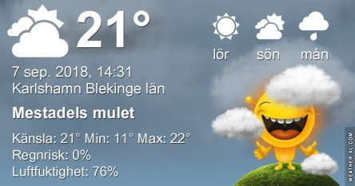
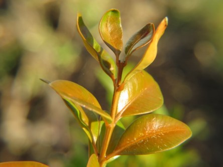
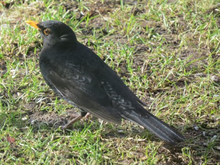
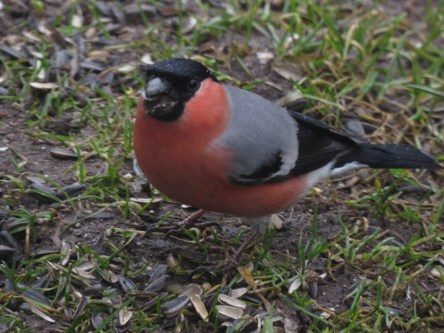
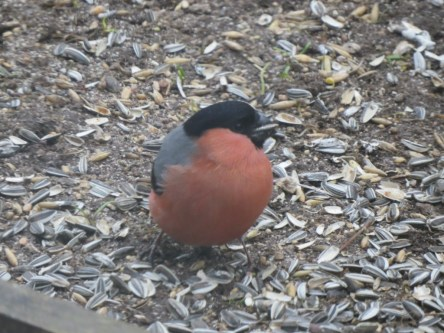

Idag går solen upp 06:16 och ned 19:40. Dagens längd är 13 timmar och 24 minuter. Det är gryning 05:37 och skymning 20:19 Det är dagsljus 14 timmar och 42 minuter. Månen går upp 02:47 och ned 18:51 Månen är belyst 10 %.

 Molnigt 14,8 C  Vindby 2,6 m/s NW  Luftfuktighet 93 %   hPa 1010 K.02:20

 Molnigt 14,2 C  Vindby 1,2 m/s NE  Luftfuktighet 97 %  hPa 1009 Kl.06:35

 Mest molnigt 23,9 C  Vindby 2,4 m/s SSE  Luftfuktighet 72 %  hPa 1008 KL.13:55

 Molnigt 16,9 C  Vindby 2,4 m/s ESE  Luftfuktighet 90 %  hPa 1007 Kl.19:45

 Idag har det varit mycket moln och en hel del fläktande.

Högst och lägst uppmätta temperatur igår (inofficiellt privat mätare): Max 25,4 C ( i solen ), Min 8,5 C Högst uppmätta vind 2 m/s. Högst uppmätta vindby 3,1 m/s

Högst och lägst uppmätta temperatur igår (officiellt enligt [YR.NO](http://www.vackertvader.se/v%C3%A4derstation/karlshamn?utm_source=email&utm_medium=email&utm_campaign=asarum)) Max 20,8 C, Min 7,6 C Högst uppmätta vind 3 m/s. Högst uppmätta vindby 5,8 m/s

 En salig blandning från arkivet del 2
