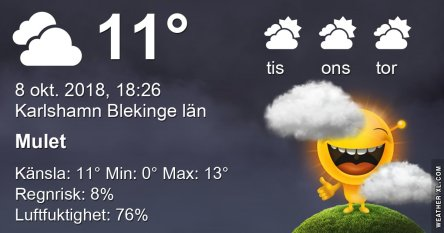
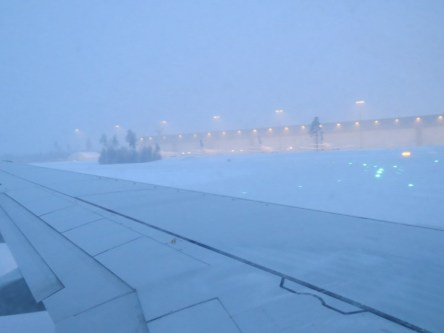
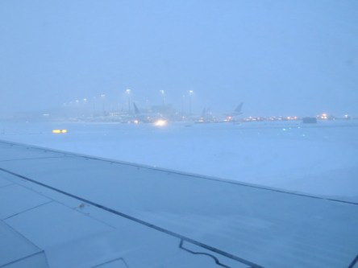
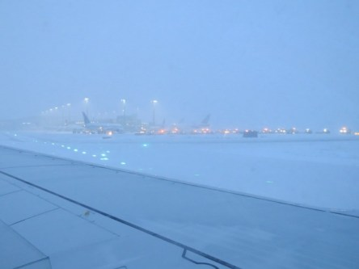
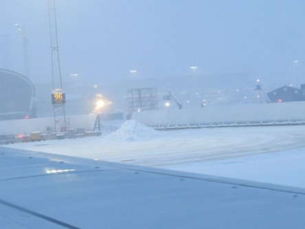
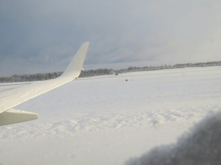
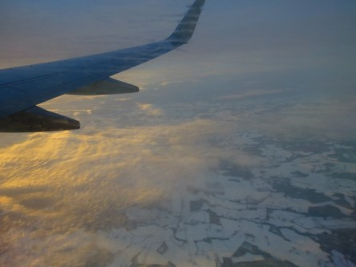

Idag går solen upp 07:17 och ned 18:18. Dagens längd är 11 timmar och 01 minuter. Det är gryning 06:40 och skymning 18:55 Det är dagsljus 12 timmar och 15 minuter. Månen går upp 05:53 och ned 18:31 Månen är belyst 6 %.

 Mest molnigt - 0,3 C  Vindstilla  Luftfuktighet 94 %  hPa 1017 Kl.01:40

 Mest molnigt 4,3 C  Vindby 1,2 m/s S  Luftfuktighet 98 %  hPa 1016 Kl.05:50

 Mest molnigt 15,2 C  Vindby 4,8 m/s ESE  Luftfuktighet 63 %  hPa 1015 Kl.14:15

 Molnigt 8,8 C  Vindby 2,4 m/s ESE  Luftfuktighet 80 %  hPa 1015 Kl.19:55

 Nu ska det bli varmt igen några dagar. Upp till 20 grader på sina håll.

Högst och lägst uppmätta temperatur igår (inofficiellt privat mätare): Max 16,4 C , Min 1 C Högst uppmätta vind 2,4 m/s, Högst uppmätta vindby 3,7 m/s

Högst och lägst uppmätta temperatur igår (officiellt enligt [YR.NO](http://www.vackertvader.se/v%C3%A4derstation/karlshamn?utm_source=email&utm_medium=email&utm_campaign=asarum)) Max 12 C, Min - 0,3 C Högst uppmätta vind 4,7 m/s. Högst uppmätta vindby 12,8 m/s

### **Sista delen i min serie om vår strapatsrika Dubairesa.**

Då var det dags att åka hem efter att vi tillbringat en vecka, nåja nästan en vecka, i Dubai. En hel del gick som sagt inte riktigt som vi tänkt oss men vi fick en härlig upplevelse där ändå. Och nu är det dags att bege sig till flygplatsen för att åka hem. Allt gick bra och vi kom på planet utan större krångel och sen var det bara att vänta på att vi skulle lyfta. Det gick också bra och vi kom i väg och styrde kosan mot Olso där vi skulle byta plan för att sedan åka till Köpenhamn. Allt gick bra och vi kom fram till Oslo och landade där. När vi skulle gå ur planet och över till terminalen så var det en ordentlig skillnad på vädret jämfört med Dubai. Här var det full snöstorm och vi frös rejält när vi kom ur planet. Väl inne i terminalen så var det bara att sätta sig och vänta på att vi skulle få gå ombord på planet till Köpenhamn. Det var här vår nyfunna tur tog slut. Nu fick vi veta att det skulle dröja ett tag innan vi kunde gå ombord eftersom snöstormen ställde till det på banan. De hann inte med att ploga banan innan den var full med snö igen. Så nu började väntandet. Igen! Det kändes lite som dejavu. Hur länge skulle vi nu bli sittande här undrade man. Ingen kunde ge besked. Och efterhand som klockan gick började jag bli orolig eftersom jag skulle börja jobba natten efter vi kom hem. Men nu såg det ut som att vi inte skulle komma hem i tid. Klockan gick och fortfarande inga besked om när vi skulle komma iväg. Då fick jag försöka komma i kontakt med mitt jobb för att tala om att jag satt fast i snöstormen i Olso och inte skulle hinna hem i tid för att jobba. Så jag fick begära en extra semesternatt med väldigt kort varsel. Det tog ett tag innan jag fick besked från jobbet att de fixat en vikarie till en natt till. Så då kunde jag koppla bort det problemet åtminstone. Så nu var det bara till att vänta på att vi skulle få flyga hem. Och den väntan blev lång med varierande besked hela tiden om när vi skulle komma iväg. Så äntligen, efter sex timmars väntan, fick vi äntligen gå ombord på planet hem. Så nu var vi äntligen på väg till Kastrup! Allt gick bra på hemresan men det var en hel del turbulens bitvis och efterhand som vi närmade oss Danmark så fick vi veta att det var storm där och att det skulle bli en skakig landning. Och ovanpå allt annat elände vi varit med om så fick vi veta att de förmodligen skulle stänga Öresundsbron på grund av stormen!!! Åh neeej tänkte vi, högt. Vad gör vi om vi inte kommer över till Sverige innan de stänger bron? Nerverna satt utanpå nu kan jag jag säga. Vi kom in över Danmark och nog blåste det alltid. Det blev en landning som definitivt var skakig. Men piloten var väldigt skicklig och fick ner oss säkert och väldigt mjukt trots det. Äntligen i Danmark! Nu gällde det att hinna över bron innan det var för sent. Det blev gatlopp till bagageutlämningen och sen kvickt som ögat till bilen. Och väl i bilen var det gasen i botten, nästan i alla fall, och iväg mot bron och hoppas på att det inte var försent. Och den här gången hade vi tur för bron var öppen, men vi fick inte köra fortare än femtio på grund av stormen. Så efter mycket om och men så var vi äntligen över på svensk mark igen!!! Och gissa vad? Strax efter att vi kört över bron fick vi höra på radion att de stängt bron på grund av stormen! Snacka om att vi jublade som hann över. Slutet gott allting gott! Det här var berättelsen om vår innehållsrika Dubairesa 2015. Tack för att ni hängt med på resan.

 Snöstorm på Gardemoen i Olso

 Här tillbringade vi sex timmar i väntan på att få lyfta till Danmark.

 På väg hem! Äntligen!
