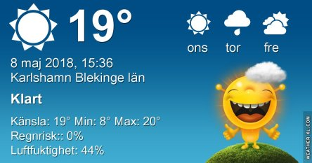
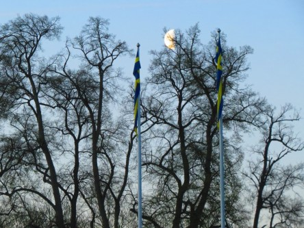
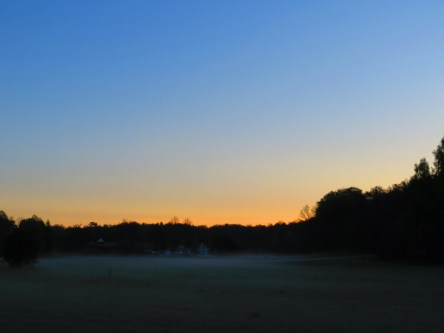
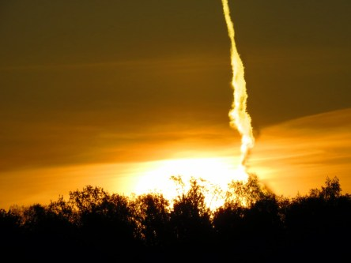

Idag går solen upp 05:01 och ned 20:53. Månen går upp 03:00 och ned 11:54 Månen är belyst 50 %. Dagens längd är 15 timmar och 52 minuter

 Mest klart 5,5 C  Vindstilla  Luftfuktighet 97 %  hPa 1017 Kl.01:50

 Halvklart 12,3 C  Vindstilla  Luftfuktighet 62 %  hPa 1016 Kl.07:15

 Mest klart 26,6 C  Vindby 2,2 m/s E  Luftfuktighet 30 %  hPa 1015 Kl.14:50

 Tunna slöjmoln 10,5 C  Vindstilla  Luftfuktighet 65 %  hPa 1013 Kl.21:05

 Sommar sommar sommar...

Högst och lägst uppmätta temperatur igår (inofficiellt privat mätare): Max 29,8 C ( i solen ) , Min 4,8 C Högst uppmätta vind 3,4 m/s. Högst uppmätta vindby 4,8 m/s.

Högst och lägst uppmätta temperatur igår (officiellt enligt [YR.NO](http://www.vackertvader.se/v%C3%A4derstation/karlshamn?utm_source=email&utm_medium=email&utm_campaign=asarum)) Max 22,8 C, Min 2,6 C Högst uppmätta vind 3,8 m/s. Högst uppmätta vindby 7,7 m/s

 Tidig morgon i Asarum.

 Störtdykning!
